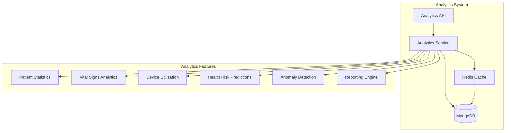

# Analytics Implementation Guide

## Overview

The My FirstCare Opera Panel now includes a comprehensive analytics system that provides healthcare insights, predictive modeling, and data visualization capabilities.

## Architecture



## API Endpoints

### Patient Statistics
```http
GET /analytics/patients/statistics
```
- **Parameters**:
  - `hospital_id` (optional): Filter by hospital
  - `start_date` (optional): Analysis start date
  - `end_date` (optional): Analysis end date
- **Response**: Patient demographics, risk distribution, age/gender breakdown
- **Cache**: 5 minutes

### Vital Signs Analytics
```http
GET /analytics/vitals/{patient_id}
```
- **Parameters**:
  - `vital_type` (optional): blood_pressure, heart_rate, temperature, spo2
  - `period`: daily, weekly, monthly, quarterly, yearly
- **Response**: Statistical analysis, trends, anomalies, categories
- **Cache**: 3 minutes

### Device Utilization
```http
GET /analytics/devices/utilization
```
- **Parameters**:
  - `hospital_id` (optional): Filter by hospital
  - `device_type` (optional): Filter by device type
  - `period`: Analysis period
- **Response**: Device usage statistics, compliance rates
- **Cache**: 10 minutes

### Health Risk Predictions
```http
GET /analytics/health-risks/{patient_id}
```
- **Parameters**:
  - `include_recommendations`: Include health recommendations (default: true)
- **Response**: Risk score, risk factors, predictions, recommendations
- **Cache**: 5 minutes

### Vital Trends
```http
GET /analytics/trends/vitals
```
- **Parameters**:
  - `patient_id` (optional): Single patient trends
  - `hospital_id` (optional): Hospital-wide trends
  - `vital_type` (required): Type of vital sign
  - `days`: Number of days to analyze (1-365)
- **Response**: Trend analysis with direction, slope, statistics

### Anomaly Detection
```http
GET /analytics/anomalies/detect
```
- **Parameters**:
  - `hospital_id` (optional): Filter by hospital
  - `patient_id` (optional): Filter by patient
  - `threshold`: Z-score threshold (1.0-4.0, default: 2.0)
  - `days`: Analysis period (1-30)
- **Response**: Detected anomalies with severity and context

### Summary Reports
```http
GET /analytics/reports/summary/{report_type}
```
- **Report Types**:
  - `patient`: Patient statistics summary
  - `hospital`: Hospital performance metrics
  - `device`: Device utilization report
  - `health_risk`: Aggregate risk analysis
  - `system_overview`: Complete system analytics
- **Cache**: 30 minutes

### Export Analytics
```http
POST /analytics/export/{format}
```
- **Formats**: json, csv, excel, pdf
- **Parameters**:
  - `report_type` (required): Type of report to export
  - `hospital_id` (optional): Filter by hospital
  - `start_date` (optional): Export start date
  - `end_date` (optional): Export end date

## Analytics Service Features

### 1. Patient Statistics
- Total patient count
- New patient admissions
- Active vs inactive patients
- Age distribution (0-17, 18-29, 30-44, 45-59, 60-74, 75+)
- Gender distribution
- Risk level distribution

### 2. Vital Signs Analytics
- Statistical analysis (mean, median, std dev, min, max)
- Trend detection (increasing, stable, decreasing)
- Anomaly detection using Z-score method
- Categorization by normal ranges
- Time-based aggregation

### 3. Device Analytics
- Utilization rates by device type
- Compliance tracking
- Reading frequency analysis
- Device distribution across hospitals
- Performance metrics

### 4. Health Risk Predictions
- Multi-factor risk scoring
- Demographic risk factors
- Vital signs risk analysis
- Predictive health events
- Personalized recommendations

### 5. Anomaly Detection
- Statistical outlier detection (Z-score > 2.0)
- Critical value monitoring
- Rapid change detection
- Pattern-based anomalies
- Real-time alerting

## Implementation Details

### Analytics Service (`app/services/analytics.py`)

```python
class HealthcareAnalytics:
    def __init__(self):
        self.db = mongodb_service
        self.collections = {
            "patients": "patients",
            "medical_history": "medical_history",
            "observations": "fhir_observations",
            "devices": ["ava4_sub_devices", "kati_watches", "qube_vital_devices"],
            "hospitals": "hospitals",
            "device_data": "device_data"
        }
```

### Vital Sign Thresholds

```python
self.thresholds = {
    "blood_pressure": {
        "normal": {"systolic": (90, 120), "diastolic": (60, 80)},
        "elevated": {"systolic": (120, 130), "diastolic": (80, 80)},
        "high": {"systolic": (130, 180), "diastolic": (80, 120)},
        "critical": {"systolic": (180, float('inf')), "diastolic": (120, float('inf'))}
    },
    "heart_rate": {
        "low": (0, 60),
        "normal": (60, 100),
        "high": (100, 150),
        "critical": (150, float('inf'))
    },
    "temperature": {
        "low": (0, 36.0),
        "normal": (36.0, 37.5),
        "fever": (37.5, 39.0),
        "high_fever": (39.0, float('inf'))
    },
    "spo2": {
        "critical": (0, 90),
        "low": (90, 95),
        "normal": (95, 100)
    }
}
```

### Caching Strategy

- Patient statistics: 5 minutes
- Vital signs: 3 minutes
- Device analytics: 10 minutes
- Health risks: 5 minutes
- Reports: 30 minutes

### Risk Scoring Algorithm

1. **Demographic Factors** (0-30 points):
   - Age risk (0-15 points)
   - Gender-specific risks (0-5 points)
   - Medical history (0-10 points)

2. **Vital Signs Risk** (0-40 points):
   - Blood pressure (0-20 points)
   - Heart rate (0-10 points)
   - Temperature (0-5 points)
   - SpO2 (0-5 points)

3. **Behavioral Factors** (0-30 points):
   - Device compliance (0-10 points)
   - Medication adherence (0-10 points)
   - Activity levels (0-10 points)

Total risk score normalized to 0.0-1.0 scale.

## Usage Examples

### Get Patient Statistics
```bash
curl -X GET "http://localhost:5054/analytics/patients/statistics?hospital_id=123" \
  -H "Authorization: Bearer <token>"
```

### Analyze Vital Signs
```bash
curl -X GET "http://localhost:5054/analytics/vitals/patient123?vital_type=blood_pressure&period=weekly" \
  -H "Authorization: Bearer <token>"
```

### Detect Anomalies
```bash
curl -X GET "http://localhost:5054/analytics/anomalies/detect?threshold=2.5&days=7" \
  -H "Authorization: Bearer <token>"
```

### Generate Hospital Report
```bash
curl -X GET "http://localhost:5054/analytics/reports/summary/hospital?hospital_id=456" \
  -H "Authorization: Bearer <token>"
```

## Best Practices

1. **Performance**:
   - Use appropriate time periods for analysis
   - Leverage caching for frequently accessed data
   - Consider pagination for large datasets

2. **Accuracy**:
   - Ensure sufficient data points for statistical analysis
   - Validate thresholds against medical standards
   - Regular calibration of risk scoring

3. **Security**:
   - All endpoints require authentication
   - Patient data is encrypted at rest
   - Audit logging for all analytics access

4. **Integration**:
   - Real-time updates via WebSocket
   - Export capabilities for external analysis
   - Compatible with FHIR standards

## Troubleshooting

### Common Issues

1. **Insufficient Data**:
   - Ensure minimum data points (10 for anomaly detection)
   - Check date ranges for data availability

2. **Performance Issues**:
   - Check cache hit rates
   - Optimize MongoDB queries with indexes
   - Use appropriate aggregation periods

3. **Inaccurate Predictions**:
   - Verify threshold configurations
   - Check for data quality issues
   - Review risk scoring weights

## Future Enhancements

1. **Machine Learning Integration**:
   - TensorFlow models for predictions
   - Pattern recognition algorithms
   - Automated threshold optimization

2. **Advanced Visualizations**:
   - Real-time dashboards
   - Interactive charts
   - Heatmap visualizations

3. **Predictive Capabilities**:
   - Disease progression modeling
   - Treatment outcome predictions
   - Resource utilization forecasting 