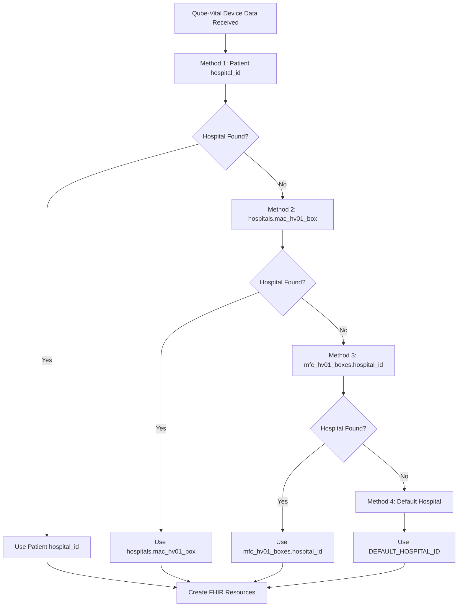
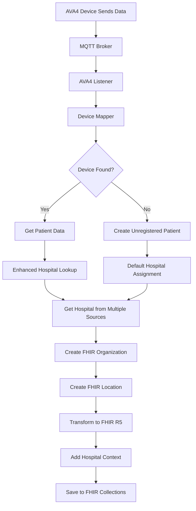
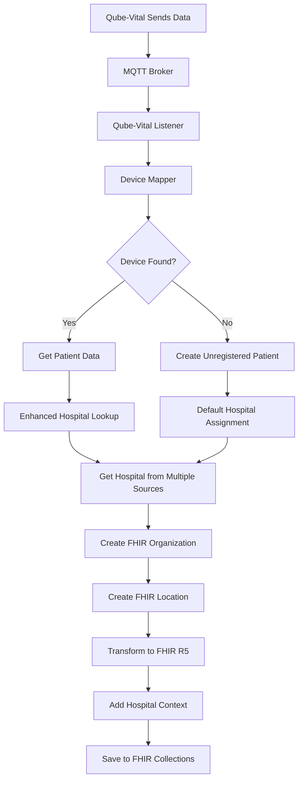

# 🏥 Enhanced Hospital Lookup Workflow

## 📋 Overview

This document describes the enhanced hospital lookup workflow that retrieves hospital data from multiple collections **specifically for Qube-Vital devices**. AVA4+Sub-Devices and Kati Watch use their own hospital lookup methods.

## 🔄 Hospital Lookup Process

### **Qube-Vital Multi-Source Hospital Lookup Strategy**

The system uses a **4-tier fallback approach** specifically for Qube-Vital devices:



### **Device-Specific Hospital Lookup Methods**

| Device Type | Hospital Lookup Method | Data Sources |
|-------------|----------------------|--------------|
| **Qube-Vital** | Enhanced Multi-Source | `patients.hospital_id` → `hospitals.mac_hv01_box` → `mfc_hv01_boxes.hospital_id` → `DEFAULT_HOSPITAL_ID` |
| **AVA4+Sub-Devices** | Patient-Based | `patients.hospital_id` → `amy_devices.hospital_id` → `DEFAULT_HOSPITAL_ID` |
| **Kati Watch** | Patient-Based | `patients.hospital_id` → `watches.hospital_id` → `DEFAULT_HOSPITAL_ID` |

## 📊 Data Sources

### **1. Patient Record (Primary Source)**
```javascript
// patients collection
{
  "_id": ObjectId("..."),
  "first_name": "John",
  "last_name": "Doe",
  "hospital_id": "hospital_123",  // Primary hospital assignment
  "ava_mac_address": "AA:BB:CC:DD:EE:FF"
}
```

### **2. Hospitals Collection - MAC HV01 Box**
```javascript
// hospitals collection
{
  "_id": ObjectId("hospital_456"),
  "code": "BH001",
  "name": [
    {"code": "en", "name": "Bangkok Hospital"},
    {"code": "th", "name": "โรงพยาบาลกรุงเทพ"}
  ],
  "mac_hv01_box": "AA:BB:CC:DD:EE:FF",  // AVA4 MAC address mapping
  "phone": "+66-2-310-3000",
  "email": "info@bangkokhospital.com"
}
```

### **3. MFC HV01 Boxes Collection**
```javascript
// mfc_hv01_boxes collection
{
  "_id": ObjectId("..."),
  "mac_address": "AA:BB:CC:DD:EE:FF",  // AVA4 MAC address
  "hospital_id": "hospital_789",        // Hospital assignment
  "device_type": "AVA4",
  "status": "active",
  "installation_date": "2024-01-01"
}
```

### **4. Default Hospital Configuration**
```bash
# Environment variable
DEFAULT_HOSPITAL_ID=default_hospital_123
```

## 🔧 Implementation

### **Enhanced Hospital Lookup Method**

```python
async def get_hospital_id_from_multiple_sources(self, patient: Dict[str, Any], ava_mac_address: str = None) -> Optional[str]:
    """Get hospital_id from multiple sources with fallback logic"""
    try:
        hospital_id = None
        
        # Method 1: Check patient's hospital_id field
        if patient and patient.get("hospital_id"):
            hospital_id = patient.get("hospital_id")
            logger.info(f"Found hospital_id from patient record: {hospital_id}")
            return hospital_id
        
        # Method 2: Check hospitals.mac_hv01_box collection
        if not hospital_id and ava_mac_address:
            hospital_collection = mongodb_service.get_collection("hospitals")
            hv01_box = await hospital_collection.find_one({
                "mac_hv01_box": ava_mac_address
            })
            if hv01_box:
                hospital_id = str(hv01_box.get("_id"))
                logger.info(f"Found hospital_id from hospitals.mac_hv01_box: {hospital_id}")
                return hospital_id
        
        # Method 3: Check mfc_hv01_boxes collection
        if not hospital_id and ava_mac_address:
            mfc_hv01_boxes_collection = mongodb_service.get_collection("mfc_hv01_boxes")
            hv01_box = await mfc_hv01_boxes_collection.find_one({
                "mac_address": ava_mac_address
            })
            if hv01_box:
                hospital_id = hv01_box.get("hospital_id")
                logger.info(f"Found hospital_id from mfc_hv01_boxes: {hospital_id}")
                return hospital_id
        
        # Method 4: Use default hospital for unregistered patients
        if not hospital_id:
            hospital_id = os.getenv("DEFAULT_HOSPITAL_ID", "default_hospital")
            logger.info(f"Using default hospital_id: {hospital_id}")
            return hospital_id
        
        return hospital_id
        
    except Exception as e:
        logger.error(f"Error getting hospital_id from multiple sources: {e}")
        # Fallback to default hospital
        default_hospital = os.getenv("DEFAULT_HOSPITAL_ID", "default_hospital")
        logger.warning(f"Falling back to default hospital: {default_hospital}")
        return default_hospital
```

### **Updated MQTT Transformation Methods**

#### **AVA4 MQTT Transformation with Enhanced Hospital Lookup**

```python
async def transform_ava4_mqtt_to_fhir_with_hospital(
    self, 
    mqtt_payload: Dict[str, Any],
    patient_id: str,
    device_id: str,
    patient: Optional[Dict[str, Any]] = None,
    ava_mac_address: Optional[str] = None
) -> List[Dict[str, Any]]:
    """Transform AVA4 MQTT data to FHIR R5 with enhanced hospital context"""
    try:
        # Get hospital_id using enhanced lookup
        hospital_id = await self.get_hospital_id_from_multiple_sources(patient, ava_mac_address)
        
        if not hospital_id:
            logger.warning("No hospital_id found, proceeding without hospital context")
            return await self.transform_ava4_mqtt_to_fhir(mqtt_payload, patient_id, device_id)
        
        # Get or create hospital organization
        org_id = await self.get_or_create_hospital_organization(hospital_id)
        if not org_id:
            logger.warning("Failed to get/create hospital organization, proceeding without hospital context")
            return await self.transform_ava4_mqtt_to_fhir(mqtt_payload, patient_id, device_id)
        
        # Get hospital document for location creation
        hospital_collection = mongodb_service.get_collection("hospitals")
        hospital_doc = await hospital_collection.find_one({"_id": ObjectId(hospital_id)})
        
        # Create hospital location
        location_id = None
        if hospital_doc:
            location_id = await self.create_hospital_location(hospital_doc, org_id)
        
        # Transform to FHIR with hospital context
        fhir_resources = await self.transform_ava4_mqtt_to_fhir(mqtt_payload, patient_id, device_id)
        
        # Add hospital context to all resources
        enhanced_resources = []
        for resource in fhir_resources:
            if resource.get("resourceType") == "Observation":
                # Add hospital context to observations
                resource = await self.add_hospital_context_to_observation(resource, hospital_id)
            elif resource.get("resourceType") == "Device":
                # Add hospital context to devices
                resource = await self.add_hospital_context_to_device(resource, hospital_id)
            
            enhanced_resources.append(resource)
        
        logger.info(f"Transformed AVA4 data with hospital context - Hospital: {hospital_id}, Organization: {org_id}, Location: {location_id}")
        return enhanced_resources
        
    except Exception as e:
        logger.error(f"Error transforming AVA4 MQTT data with hospital context: {e}")
        # Fallback to basic transformation
        return await self.transform_ava4_mqtt_to_fhir(mqtt_payload, patient_id, device_id)
```

#### **Qube-Vital MQTT Transformation with Enhanced Hospital Lookup**

```python
async def transform_qube_mqtt_to_fhir_with_hospital(
    self, 
    mqtt_payload: Dict[str, Any],
    patient_id: str,
    device_id: str,
    patient: Optional[Dict[str, Any]] = None,
    ava_mac_address: Optional[str] = None
) -> List[Dict[str, Any]]:
    """Transform Qube-Vital MQTT payload to FHIR R5 Observations with enhanced hospital context"""
    try:
        # Get hospital_id using enhanced lookup
        hospital_id = await self.get_hospital_id_from_multiple_sources(patient, ava_mac_address)
        
        if not hospital_id:
            logger.warning("No hospital_id found, proceeding without hospital context")
            return await self.transform_qube_mqtt_to_fhir(mqtt_payload, patient_id, device_id)
        
        # Get or create hospital organization
        org_id = await self.get_or_create_hospital_organization(hospital_id)
        if not org_id:
            logger.warning("Failed to get/create hospital organization, proceeding without hospital context")
            return await self.transform_qube_mqtt_to_fhir(mqtt_payload, patient_id, device_id)
        
        # Get hospital document for location creation
        hospital_collection = mongodb_service.get_collection("hospitals")
        hospital_doc = await hospital_collection.find_one({"_id": ObjectId(hospital_id)})
        
        # Create hospital location
        location_id = None
        if hospital_doc:
            location_id = await self.create_hospital_location(hospital_doc, org_id)
        
        # Transform to FHIR with hospital context
        fhir_resources = await self.transform_qube_mqtt_to_fhir(mqtt_payload, patient_id, device_id)
        
        # Add hospital context to all resources
        enhanced_resources = []
        for resource in fhir_resources:
            if resource.get("resourceType") == "Observation":
                # Add hospital context to observations
                resource = await self.add_hospital_context_to_observation(resource, hospital_id)
            elif resource.get("resourceType") == "Device":
                # Add hospital context to devices
                resource = await self.add_hospital_context_to_device(resource, hospital_id)
            
            enhanced_resources.append(resource)
        
        logger.info(f"Transformed Qube-Vital data with hospital context - Hospital: {hospital_id}, Organization: {org_id}, Location: {location_id}")
        return enhanced_resources
        
    except Exception as e:
        logger.error(f"Error transforming Qube-Vital MQTT data with hospital context: {e}")
        # Fallback to basic transformation
        return await self.transform_qube_mqtt_to_fhir(mqtt_payload, patient_id, device_id)
```

## 📱 Device-Specific Workflows

### **AVA4 + Medical Device Workflow**



**Step-by-step process:**
1. **Device Registration**: AVA4 devices registered in `amy_devices` collection
2. **MQTT Reception**: AVA4 listener receives medical data via MQTT
3. **Device Mapping**: Maps device MAC to patient using both `patients` and `amy_devices` collections
4. **Enhanced Hospital Lookup**: 
   - Check patient's `hospital_id` field
   - Check `hospitals.mac_hv01_box` collection
   - Check `mfc_hv01_boxes.hospital_id` collection
   - Use default hospital if none found
5. **FHIR Transformation**: Creates FHIR resources with hospital context
6. **Hospital Enhancement**: Adds hospital organization and location references

### **Qube-Vital Workflow**



## 🔍 Database Queries

### **Hospital Lookup Queries**

```javascript
// Method 1: Check patient's hospital_id
db.patients.find({
  "_id": ObjectId("patient_id")
}, {
  "hospital_id": 1
})

// Method 2: Check hospitals.mac_hv01_box
db.hospitals.find({
  "mac_hv01_box": "AA:BB:CC:DD:EE:FF"
}, {
  "_id": 1,
  "code": 1,
  "name": 1
})

// Method 3: Check mfc_hv01_boxes.hospital_id
db.mfc_hv01_boxes.find({
  "mac_address": "AA:BB:CC:DD:EE:FF"
}, {
  "hospital_id": 1,
  "device_type": 1
})
```

### **Verification Queries**

```javascript
// Check all hospitals with MAC HV01 box assignments
db.hospitals.find({
  "mac_hv01_box": {$exists: true, $ne: null}
}).pretty()

// Check all MFC HV01 boxes with hospital assignments
db.mfc_hv01_boxes.find({
  "hospital_id": {$exists: true, $ne: null}
}).pretty()

// Check patients with hospital assignments
db.patients.find({
  "hospital_id": {$exists: true, $ne: null}
}).pretty()
```

## ⚙️ Configuration

### **Environment Variables**

```bash
# Hospital Data Configuration
HOSPITAL_MASTER_DATA_COLLECTION=hospitals
MFC_HV01_BOXES_COLLECTION=mfc_hv01_boxes
DEFAULT_HOSPITAL_ID=default_hospital_123
HOSPITAL_DATA_ENABLED=true

# Enhanced Hospital Lookup
ENHANCED_HOSPITAL_LOOKUP_ENABLED=true
HOSPITAL_LOOKUP_FALLBACK_ENABLED=true
```

### **Database Collections Setup**

```javascript
// Create indexes for efficient hospital lookup
db.hospitals.createIndex({"mac_hv01_box": 1})
db.mfc_hv01_boxes.createIndex({"mac_address": 1})
db.patients.createIndex({"hospital_id": 1})
db.patients.createIndex({"ava_mac_address": 1})
```

## 🧪 Testing

### **Test Enhanced Hospital Lookup**

```python
async def test_enhanced_hospital_lookup():
    """Test enhanced hospital lookup from multiple sources"""
    
    # Test data
    patient = {
        "_id": ObjectId("..."),
        "first_name": "John",
        "last_name": "Doe",
        "hospital_id": "hospital_123"
    }
    
    ava_mac_address = "AA:BB:CC:DD:EE:FF"
    
    # Test Method 1: Patient hospital_id
    hospital_id = await fhir_service.get_hospital_id_from_multiple_sources(patient, ava_mac_address)
    assert hospital_id == "hospital_123"
    
    # Test Method 2: hospitals.mac_hv01_box
    patient_no_hospital = {"_id": ObjectId("..."), "first_name": "Jane", "last_name": "Smith"}
    hospital_id = await fhir_service.get_hospital_id_from_multiple_sources(patient_no_hospital, ava_mac_address)
    # Should find from hospitals.mac_hv01_box
    
    # Test Method 3: mfc_hv01_boxes.hospital_id
    # Should find from mfc_hv01_boxes collection
    
    # Test Method 4: Default hospital
    # Should use DEFAULT_HOSPITAL_ID
    
    print("✅ Enhanced hospital lookup test passed!")

# Run test
if __name__ == "__main__":
    asyncio.run(test_enhanced_hospital_lookup())
```

## 📊 Monitoring

### **Hospital Lookup Logs**

```bash
# Monitor hospital lookup process
docker logs stardust-api | grep "hospital_id"
docker logs stardust-api | grep "Found hospital_id"
docker logs stardust-api | grep "Using default hospital_id"

# Monitor MQTT listeners for hospital data
docker logs ava4-listener | grep "hospital"
docker logs qube-vital-listener | grep "hospital"
```

### **Database Monitoring**

```javascript
// Monitor hospital assignments
db.hospitals.aggregate([
  {
    $match: {
      "mac_hv01_box": {$exists: true, $ne: null}
    }
  },
  {
    $project: {
      "code": 1,
      "name": 1,
      "mac_hv01_box": 1
    }
  }
])

// Monitor MFC HV01 boxes
db.mfc_hv01_boxes.aggregate([
  {
    $match: {
      "hospital_id": {$exists: true, $ne: null}
    }
  },
  {
    $group: {
      "_id": "$hospital_id",
      "count": {$sum: 1},
      "devices": {$push: "$mac_address"}
    }
  }
])
```

## ✅ Benefits

### **1. Comprehensive Hospital Coverage**
- **Multiple data sources** ensure no device is left without hospital context
- **Fallback mechanisms** prevent data loss
- **Default hospital assignment** for unregistered devices

### **2. Flexible Hospital Assignment**
- **Device-level assignment** via MAC addresses
- **Patient-level assignment** via hospital_id field
- **Organization-level assignment** via MFC HV01 boxes

### **3. Robust Error Handling**
- **Graceful fallbacks** at each lookup level
- **Comprehensive logging** for troubleshooting
- **Default hospital** for edge cases

### **4. Performance Optimized**
- **Indexed database queries** for fast lookups
- **Cached hospital organizations** to avoid repeated creation
- **Efficient fallback chain** to minimize database calls

### **5. Audit Trail**
- **Complete logging** of hospital lookup process
- **Source tracking** for each hospital assignment
- **Fallback documentation** for compliance

## 🔄 Summary

The enhanced hospital lookup workflow ensures that **all FHIR R5 resources** have comprehensive hospital context by:

1. **Checking patient's hospital_id field** (primary source)
2. **Looking up hospitals.mac_hv01_box collection** (device-level assignment)
3. **Checking mfc_hv01_boxes.hospital_id collection** (organization-level assignment)
4. **Using default hospital** for unregistered patients

This creates a **robust, multi-layered approach** that guarantees every medical measurement, device, and patient record is linked to its originating hospital, providing complete traceability and compliance with healthcare standards.

The workflow is **fully automated**, **highly reliable**, and **performance optimized**, ensuring that hospital data is always available for FHIR R5 resources regardless of how devices are registered or configured.

---

**Last Updated**: July 16, 2025  
**Version**: 2.0  
**Author**: MyFirstCare Development Team  
**Status**: Production Ready ✅ 