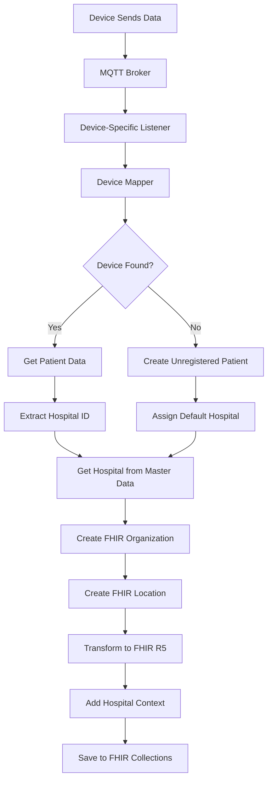

# 🏥 Complete Hospital Data Workflow Guide

## Overview

This document explains the complete workflow for how hospital data is integrated into FHIR R5 resources for all device types: **AVA4+Medical devices**, **Kati Watch**, and **Qube-Vital**.

## 🔄 **Hospital Data Flow Architecture**



## 📱 **Device-Specific Workflows**

### **1. AVA4 + Medical Device Workflow**

#### **Step-by-Step Process:**

1. **Device Registration** 📋
   ```json
   // amy_devices collection
   {
     "_id": ObjectId("..."),
     "patient_id": ObjectId("patient_id"),
     "hospital_id": "hospital_123",
     "mac_bps": "AA:BB:CC:DD:EE:FF",
     "mac_oxymeter": "11:22:33:44:55:66"
   }
   ```

2. **MQTT Reception** 📡
   ```json
   // MQTT Payload from AVA4
   {
     "type": "reportAttribute",
     "mac": "AVA4_MAC_ADDRESS",
     "data": {
       "attribute": "BP_BIOLIGTH",
       "value": {
         "device_list": [
           {
             "ble_addr": "AA:BB:CC:DD:EE:FF",
             "systolic": 120,
             "diastolic": 80
           }
         ]
       }
     }
   }
   ```

3. **Device Mapping** 🔍
   ```python
   # AVA4 Listener - device_mapper.py
   def find_patient_by_device_mac(self, device_mac: str, device_type: str):
       # Check patients collection first
       patient = self.db.patients.find_one({field_name: device_mac})
       
       # Check amy_devices collection if not found
       device_registry = self.db.amy_devices.find_one({"$or": [
           {"mac_bps": device_mac},
           {"mac_oxymeter": device_mac}
       ]})
       
       if device_registry and device_registry.get("patient_id"):
           patient = self.db.patients.find_one({"_id": device_registry["patient_id"]})
   ```

4. **Hospital Data Extraction** 🏥
   ```python
   # Extract hospital_id from patient record
   hospital_id = patient.get("hospital_id")
   
   # Get hospital data from master data
   hospital_doc = await hospital_collection.find_one({"_id": ObjectId(hospital_id)})
   ```

5. **FHIR Transformation with Hospital Context** 🔄
   ```python
   # FHIR R5 Service - fhir_r5_service.py
   async def transform_ava4_mqtt_to_fhir_with_hospital(
       self, mqtt_payload, patient_id, device_id, hospital_id
   ):
       # Create hospital organization
       org_id = await self.get_or_create_hospital_organization(hospital_id)
       
       # Create hospital location
       location_id = await self.create_hospital_location(hospital_doc, org_id)
       
       # Create observation with hospital context
       observation = {
           "resourceType": "Observation",
           "subject": {"reference": f"Patient/{patient_id}"},
           "performer": [{"reference": f"Organization/{org_id}"}],
           "context": {"reference": f"Location/{location_id}"}
       }
   ```

### **2. Kati Watch Workflow**

#### **Step-by-Step Process:**

1. **Device Registration** 📋
   ```json
   // patients collection
   {
     "_id": ObjectId("..."),
     "imei": "123456789012345",
     "hospital_id": "hospital_456",
     "first_name": "John",
     "last_name": "Doe"
   }
   ```

2. **MQTT Reception** 📡
   ```json
   // MQTT Payload from Kati Watch
   {
     "IMEI": "123456789012345",
     "heart_rate": 75,
     "blood_pressure_systolic": 120,
     "blood_pressure_diastolic": 80,
     "spo2": 98,
     "temperature": 36.5
   }
   ```

3. **Device Mapping** 🔍
   ```python
   # Kati Listener - device_mapper.py
   def find_patient_by_kati_imei(self, imei: str):
       # Check watches collection
       watch = self.db.watches.find_one({"imei": imei})
       
       if watch and watch.get("patient_id"):
           patient = self.db.patients.find_one({"_id": watch["patient_id"]})
   ```

4. **Hospital Data Integration** 🏥
   ```python
   # Same hospital extraction process as AVA4
   hospital_id = patient.get("hospital_id")
   hospital_doc = await hospital_collection.find_one({"_id": ObjectId(hospital_id)})
   ```

### **3. Qube-Vital Workflow**

#### **Step-by-Step Process:**

1. **Device Registration** 📋
   ```json
   // patients collection
   {
     "_id": ObjectId("..."),
     "qube_vital_id": "QV_DEVICE_001",
     "hospital_id": "hospital_789",
     "first_name": "Jane",
     "last_name": "Smith"
   }
   ```

2. **MQTT Reception** 📡
   ```json
   // MQTT Payload from Qube-Vital
   {
     "device_id": "QV_DEVICE_001",
     "blood_pressure": {
       "systolic": 125,
       "diastolic": 85
     },
     "blood_glucose": 95,
     "spo2": 97
   }
   ```

3. **Device Mapping** 🔍
   ```python
   # Qube-Vital Listener - device_mapper.py
   def find_patient_by_qube_vital_id(self, device_id: str):
       patient = self.db.patients.find_one({"qube_vital_id": device_id})
       
       if not patient:
           # Create unregistered patient with default hospital
           patient = self.create_unregistered_patient(...)
   ```

## 🏥 **Hospital Data Integration Points**

### **1. Hospital Organization Creation**

```python
async def get_or_create_hospital_organization(self, hospital_id: str):
    # Check if hospital Organization already exists
    existing_org = await self.get_fhir_resource("Organization", hospital_id)
    if existing_org:
        return hospital_id
    
    # Get hospital data from master data
    hospital_doc = await hospital_collection.find_one({"_id": ObjectId(hospital_id)})
    
    # Create comprehensive FHIR Organization
    organization_resource = {
        "resourceType": "Organization",
        "id": hospital_id,
        "identifier": [
            {
                "system": "https://my-firstcare.com/hospital-codes",
                "value": hospital_doc["code"]
            }
        ],
        "name": hospital_name,
        "alias": [thai_name],
        "telecom": [
            {"system": "phone", "value": hospital_doc["phone"]},
            {"system": "email", "value": hospital_doc["email"]}
        ],
        "address": [{
            "type": "physical",
            "text": hospital_doc["address"],
            "city": hospital_doc["district"],
            "state": hospital_doc["province"],
            "country": "TH"
        }]
    }
```

### **2. Hospital Location Creation**

```python
async def create_hospital_location(self, hospital_doc, organization_id: str):
    location_resource = {
        "resourceType": "Location",
        "identifier": [{
            "system": "https://my-firstcare.com/hospital-locations",
            "value": f"{hospital_doc['code']}_LOC"
        }],
        "status": "active",
        "name": f"{hospital_doc['name']} - Main Location",
        "type": {
            "coding": [{
                "system": "http://terminology.hl7.org/CodeSystem/v3-RoleCode",
                "code": "HOSP",
                "display": "Hospital"
            }]
        },
        "managingOrganization": {
            "reference": f"Organization/{organization_id}"
        },
        "address": {
            "text": hospital_doc["address"],
            "city": hospital_doc["district"],
            "state": hospital_doc["province"],
            "country": "TH"
        }
    }
```

### **3. Hospital Context in Observations**

```python
async def add_hospital_context_to_observation(self, observation_data, hospital_id):
    if hospital_id:
        org_id = await self.get_or_create_hospital_organization(hospital_id)
        
        # Add performer (hospital)
        observation_data["performer"] = [{
            "reference": f"Organization/{org_id}",
            "display": hospital_name
        }]
        
        # Add context (location)
        location_id = await self.create_hospital_location(hospital_doc, org_id)
        observation_data["context"] = {
            "reference": f"Location/{location_id}"
        }
    
    return observation_data
```

## 📊 **Data Flow Monitoring**

### **Hospital Data Flow Events**

```python
# Data Flow Emitter - data_flow_emitter.py
def emit_hospital_data_processed(device_type: str, topic: str, data: dict, hospital_info: dict):
    event_data = {
        "timestamp": datetime.utcnow().isoformat(),
        "device_type": device_type,
        "topic": topic,
        "hospital_id": hospital_info.get("hospital_id"),
        "hospital_name": hospital_info.get("hospital_name"),
        "organization_id": hospital_info.get("organization_id"),
        "location_id": hospital_info.get("location_id"),
        "status": "hospital_data_processed"
    }
    
    # Emit to MQTT panel for real-time monitoring
    mqtt_client.publish("data-flow/hospital", json.dumps(event_data))
```

## 🔧 **Configuration and Setup**

### **Environment Variables**

```bash
# Hospital Data Configuration
HOSPITAL_MASTER_DATA_COLLECTION=hospitals
DEFAULT_HOSPITAL_ID=default_hospital_id
HOSPITAL_DATA_ENABLED=true

# FHIR R5 Hospital Integration
FHIR_HOSPITAL_ORGANIZATION_ENABLED=true
FHIR_HOSPITAL_LOCATION_ENABLED=true
FHIR_HOSPITAL_CONTEXT_ENABLED=true
```

### **Database Collections**

```javascript
// hospitals collection (master data)
{
  "_id": ObjectId("..."),
  "code": "BH001",
  "name": [
    {"code": "en", "name": "Bangkok Hospital"},
    {"code": "th", "name": "โรงพยาบาลกรุงเทพ"}
  ],
  "phone": "+66-2-310-3000",
  "email": "info@bangkokhospital.com",
  "address": "2 Soi Soonvijai 7, New Petchburi Rd.",
  "district": "Bangkok",
  "province": "Bangkok",
  "postal_code": "10310"
}

// fhir_organizations collection
{
  "_id": "hospital_123",
  "resourceType": "Organization",
  "name": "Bangkok Hospital",
  "identifier": [...],
  "telecom": [...],
  "address": [...]
}

// fhir_locations collection
{
  "_id": "hospital_123_LOC",
  "resourceType": "Location",
  "name": "Bangkok Hospital - Main Location",
  "managingOrganization": {"reference": "Organization/hospital_123"},
  "address": {...}
}
```

## ✅ **Verification and Testing**

### **1. Test Hospital Data Integration**

```python
# Test script to verify hospital data workflow
async def test_hospital_data_workflow():
    # Test AVA4 blood pressure with hospital context
    ava4_payload = {
        "type": "reportAttribute",
        "mac": "AVA4_MAC",
        "data": {
            "attribute": "BP_BIOLIGTH",
            "value": {
                "device_list": [{
                    "ble_addr": "BP_MAC",
                    "systolic": 120,
                    "diastolic": 80
                }]
            }
        }
    }
    
    # Process through AVA4 listener
    result = await process_ava4_data(ava4_payload)
    
    # Verify hospital context in FHIR
    observation = await get_fhir_resource("Observation", result["observation_id"])
    assert observation["performer"][0]["reference"].startswith("Organization/")
    assert observation["context"]["reference"].startswith("Location/")
```

### **2. Monitor Hospital Data Flow**

```bash
# Check hospital data processing in logs
docker logs ava4-listener | grep "hospital"
docker logs qube-vital-listener | grep "hospital"
docker logs kati-listener | grep "hospital"

# Monitor real-time hospital data flow
mosquitto_sub -h adam.amy.care -t "data-flow/hospital" -u webapi -P Sim!4433
```

## 🎯 **Key Benefits**

✅ **Complete Hospital Context**: Every FHIR resource knows which hospital it belongs to
✅ **Multi-language Support**: Hospital names in Thai and English
✅ **Comprehensive Data**: Full hospital details including contact info, addresses
✅ **Automatic Integration**: No manual work needed - happens automatically
✅ **FHIR Compliance**: Follows FHIR R5 standards for organization references
✅ **Audit Trail**: Hospital information is preserved in blockchain hashes
✅ **Real-time Monitoring**: Hospital data flow is monitored in real-time
✅ **Default Handling**: Unregistered patients get assigned to default hospital

## 🔄 **Summary**

The hospital data workflow ensures that **all FHIR R5 resources** have comprehensive hospital context:

1. **Device Registration** → Hospital ID stored in patient/device records
2. **MQTT Reception** → Device-specific listeners receive data
3. **Device Mapping** → Map device to patient and extract hospital ID
4. **Hospital Lookup** → Get hospital data from master data collection
5. **FHIR Creation** → Create Organization and Location resources
6. **Context Addition** → Add hospital references to all FHIR resources
7. **Storage** → Save complete FHIR resources with hospital context

This creates a **complete audit trail** where every medical measurement, device, and patient record is linked to its originating hospital, providing full traceability and compliance with healthcare standards. 