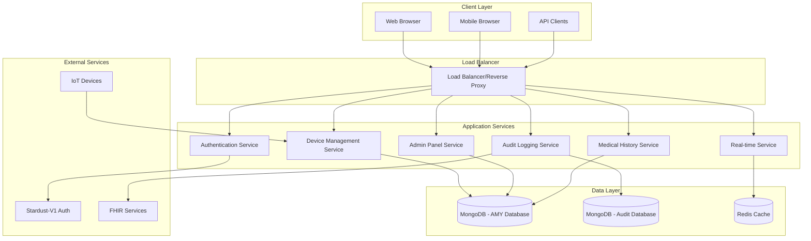

# 📋 Software Architecture Document (SAD)
## My FirstCare Opera Panel

**Document Version**: 1.0  
**Date**: June 27, 2025  
**Prepared by**: Technical Architecture Team  
**Reviewed by**: [Lead Architect]  
**Approved by**: [Technical Director]  

---

## 1. Introduction

### 1.1 Purpose
This Software Architecture Document (SAD) provides a comprehensive architectural overview of the My FirstCare Opera Panel system. It describes the architectural decisions, design patterns, and technical approaches used to implement the system requirements.

### 1.2 Scope
This document covers the complete software architecture including:
- System architecture and design patterns
- Component architecture and interactions
- Data architecture and database design
- Security architecture and authentication
- Deployment architecture and infrastructure
- Integration architecture and external interfaces

### 1.3 Audience
This document is intended for:
- Software developers and engineers
- System architects and technical leads
- DevOps and infrastructure engineers
- Technical project managers
- Quality assurance engineers

---

## 2. Architectural Overview

### 2.1 System Architecture Pattern
The My FirstCare Opera Panel follows a **Microservices Architecture** pattern with the following key characteristics:

- **Modular Design**: Loosely coupled, independently deployable services
- **API-First Approach**: RESTful APIs for all service communications
- **Event-Driven Architecture**: Asynchronous communication for real-time features
- **Container-Based Deployment**: Docker containers for consistent deployment
- **Database Per Service**: Dedicated data stores for each service domain

### 2.2 High-Level Architecture Diagram



### 2.3 Architectural Principles

1. **Separation of Concerns**: Each service has a single, well-defined responsibility
2. **Loose Coupling**: Services are independent and communicate via well-defined interfaces
3. **High Cohesion**: Related functionality is grouped within the same service
4. **Scalability**: Services can be scaled independently based on demand
5. **Resilience**: Services are designed to handle failures gracefully
6. **Security by Design**: Security considerations are built into every layer

---

## 3. Component Architecture

### 3.1 Service Components

#### 3.1.1 Authentication Service
**Purpose**: Handles user authentication and authorization

**Responsibilities**:
- Integration with Stardust-V1 authentication
- JWT token validation and management
- Role-based access control enforcement
- Session management

**Technology Stack**:
- FastAPI framework
- HTTPBearer security
- Requests library for external API calls
- Pydantic for data validation

**Interfaces**:
- `POST /auth/login` - User authentication
- `POST /auth/refresh` - Token refresh
- `GET /auth/me` - Current user information
- `POST /auth/logout` - User logout

#### 3.1.2 Device Management Service
**Purpose**: Manages IoT device data ingestion and processing

**Responsibilities**:
- Device data validation and processing
- Patient/hospital lookup and mapping
- Data routing to appropriate collections
- Device status monitoring

**Technology Stack**:
- FastAPI framework
- Motor async MongoDB driver
- Pydantic models for data validation
- Background tasks for data processing

**Interfaces**:
- `POST /api/ava4/data` - AVA4 device data
- `POST /api/kati/data` - Kati Watch data
- `POST /api/qube-vital/data` - Qube-Vital data
- `GET /api/{device}/data` - Device data retrieval
- `DELETE /api/{device}/data` - Device data deletion

#### 3.1.3 Admin Panel Service
**Purpose**: Provides web-based administrative interface

**Responsibilities**:
- User interface rendering
- Patient and device management
- Dashboard and analytics
- Report generation

**Technology Stack**:
- FastAPI with Jinja2 templates
- Tabler.io UI framework
- Chart.js for data visualization
- Socket.IO for real-time updates

**Interfaces**:
- `GET /admin/dashboard` - Main dashboard
- `GET /admin/patients` - Patient management
- `GET /admin/devices` - Device management
- `GET /admin/reports` - Reporting interface

#### 3.1.4 Medical History Service
**Purpose**: Manages medical history data and analytics

**Responsibilities**:
- Medical history data aggregation
- Cross-device data correlation
- Trend analysis and reporting
- Data archiving and cleanup

**Technology Stack**:
- FastAPI framework
- Motor async MongoDB driver
- Pandas for data analysis
- Background tasks for data processing

**Interfaces**:
- `GET /history/{type}` - Medical history retrieval
- `GET /history/trends` - Trend analysis
- `GET /history/summary` - Summary statistics
- `POST /history/export` - Data export

#### 3.1.5 Audit Logging Service
**Purpose**: Handles FHIR R5 compliant audit logging

**Responsibilities**:
- FHIR Provenance resource generation
- Audit log storage and management
- Compliance reporting
- Log retention and cleanup

**Technology Stack**:
- FastAPI framework
- Motor async MongoDB driver
- FHIR libraries for resource generation
- TTL indexes for automatic cleanup

**Interfaces**:
- `POST /audit/log` - Create audit log entry
- `GET /audit/logs` - Retrieve audit logs
- `GET /audit/compliance` - Compliance reports
- `DELETE /audit/cleanup` - Manual cleanup

#### 3.1.6 Real-time Service
**Purpose**: Provides real-time updates and notifications

**Responsibilities**:
- WebSocket connection management
- Real-time data streaming
- Push notifications
- Event broadcasting

**Technology Stack**:
- FastAPI with WebSocket support
- Socket.IO for real-time communication
- Redis for message queuing
- Background tasks for event processing

**Interfaces**:
- WebSocket `/ws/updates` - Real-time updates
- WebSocket `/ws/notifications` - Push notifications
- `POST /realtime/broadcast` - Broadcast messages
- `GET /realtime/status` - Service status

### 3.2 Data Access Layer

#### 3.2.1 MongoDB Data Access
**Purpose**: Provides abstracted access to MongoDB databases

**Components**:
- **Connection Manager**: Manages database connections and pooling
- **Collection Managers**: Specialized managers for different data types
- **Query Builder**: Builds complex MongoDB queries
- **Transaction Manager**: Handles multi-document transactions

**Collections**:
- `patients` - Patient information
- `hospitals` - Hospital and location data
- `amy_boxes` - AVA4 device information
- `watches` - Kati Watch device information
- `mfc_hv01_boxes` - Qube-Vital device information
- Medical history collections (blood_pressure_histories, etc.)
- `fhir_provenance` - Audit log entries

#### 3.2.2 Cache Layer
**Purpose**: Provides caching for frequently accessed data

**Components**:
- **Redis Cache**: In-memory caching for session data
- **Application Cache**: Local caching for static data
- **Query Cache**: Caching for expensive database queries

---

## 4. Data Architecture

### 4.1 Database Design

#### 4.1.1 AMY Database (Primary)
**Purpose**: Stores operational data for the system

**Key Collections**:

```javascript
// Patients Collection
{
  "_id": ObjectId,
  "patient_id": String,
  "name": String,
  "email": String,
  "phone": String,
  "watch_mac_address": String,
  "ava_mac_address": String,
  "new_hospital_ids": [String],
  "created_at": Date,
  "updated_at": Date,
  "deleted": Boolean,
  "deleted_at": Date,
  "deleted_by": String
}

// Medical History Collections Structure
{
  "_id": ObjectId,
  "patient_id": String,
  "device_id": String,
  "timestamp": Date,
  "data": {
    "type": String,
    "value": Mixed,
    "unit": String,
    "notes": String
  },
  "source": String, // "AVA4", "Kati", "Qube"
  "hospital_id": String,
  "created_at": Date,
  "processed_at": Date
}

// Hospitals Collection
{
  "_id": ObjectId,
  "name": String,
  "code": String,
  "province_code": String,
  "district_code": String,
  "sub_district_code": String,
  "mac_hv01_box": String,
  "address": String,
  "contact": Object,
  "created_at": Date,
  "updated_at": Date
}
```

#### 4.1.2 Audit Database (Compliance)
**Purpose**: Stores FHIR R5 compliant audit logs

**Key Collections**:

```javascript
// FHIR Provenance Collection
{
  "_id": ObjectId,
  "resourceType": "Provenance",
  "id": String,
  "recorded": Date,
  "agent": [{
    "type": {
      "text": String
    },
    "who": {
      "identifier": {
        "value": String
      }
    }
  }],
  "entity": [{
    "what": {
      "identifier": {
        "value": String
      }
    }
  }],
  "target": [{
    "reference": String
  }],
  "created_at": Date,
  "expires_at": Date // TTL index
}

// FHIR Observations Collection
{
  "_id": ObjectId,
  "resourceType": "Observation",
  "id": String,
  "status": String,
  "category": Array,
  "code": Object,
  "subject": Object,
  "effectiveDateTime": Date,
  "valueQuantity": Object,
  "device": Object,
  "created_at": Date
}
```

### 4.2 Data Flow Architecture

#### 4.2.1 Device Data Ingestion Flow
1. **Device Submission**: IoT device submits data via REST API
2. **Authentication**: JWT token validation
3. **Data Validation**: Pydantic model validation
4. **Patient/Hospital Lookup**: Cross-reference device ID
5. **Data Routing**: Route to appropriate medical history collection
6. **Audit Logging**: Generate FHIR Provenance resource
7. **Real-time Updates**: Broadcast updates to connected clients
8. **Response**: Return confirmation to device

#### 4.2.2 Admin Panel Data Flow
1. **User Request**: Admin panel request via web interface
2. **Authentication**: Session validation
3. **Authorization**: Role-based access control
4. **Data Retrieval**: Query MongoDB collections
5. **Data Aggregation**: Combine data from multiple sources
6. **Presentation**: Render data in admin interface
7. **Real-time Updates**: WebSocket updates for dynamic content

### 4.3 Data Relationships

#### 4.3.1 Entity Relationships
- **Patients ↔ Devices**: One-to-many relationship via MAC/IMEI
- **Hospitals ↔ Devices**: One-to-many for institutional devices
- **Devices ↔ Medical History**: One-to-many for data entries
- **Medical History ↔ Audit Logs**: One-to-one for compliance
- **Hospitals ↔ Geographic Data**: Many-to-one for location hierarchy

#### 4.3.2 Data Integrity Constraints
- **Referential Integrity**: Maintain relationships across collections
- **Data Validation**: Enforce data types and formats
- **Unique Constraints**: Prevent duplicate device IDs
- **Temporal Constraints**: Ensure chronological data ordering

---

## 5. Security Architecture

### 5.1 Authentication Architecture

#### 5.1.1 JWT Token Flow
1. **User Login**: User authenticates via Stardust-V1
2. **Token Issuance**: Stardust-V1 issues JWT tokens
3. **Token Storage**: Secure token storage in client
4. **Token Validation**: Each request validates token via Stardust-V1
5. **Token Refresh**: Automatic token refresh mechanism
6. **Token Expiration**: Secure token expiration handling

#### 5.1.2 Authorization Model
```python
# Role-Based Access Control
roles = {
    "admin": [
        "read:all",
        "write:all",
        "delete:all",
        "admin:system"
    ],
    "operator": [
        "read:patients",
        "read:devices",
        "write:devices",
        "read:history"
    ],
    "viewer": [
        "read:patients",
        "read:devices",
        "read:history"
    ]
}
```

### 5.2 Data Security

#### 5.2.1 Encryption Strategy
- **Data in Transit**: TLS 1.3 for all communications
- **Data at Rest**: MongoDB encryption at rest
- **Sensitive Data**: Field-level encryption for PII
- **Key Management**: Secure key rotation and management

#### 5.2.2 Access Control
- **Network Security**: Firewall rules and VPN access
- **Database Security**: MongoDB authentication and authorization
- **API Security**: Rate limiting and request validation
- **Audit Trail**: Complete audit logging for all access

### 5.3 Compliance and Privacy

#### 5.3.1 Healthcare Compliance
- **HIPAA Compliance**: Protected health information handling
- **FHIR R5 Compliance**: Standard healthcare data formats
- **Audit Requirements**: Complete audit trail maintenance
- **Data Retention**: Automated data retention policies

#### 5.3.2 Privacy Protection
- **Data Minimization**: Collect only necessary data
- **Anonymization**: Remove identifying information for analytics
- **Consent Management**: Patient consent tracking
- **Right to Deletion**: Support for data deletion requests

---

## 6. Deployment Architecture

### 6.1 Container Architecture

#### 6.1.1 Docker Container Strategy
```yaml
# Docker Compose Structure
services:
  auth-service:
    image: opera-panel/auth-service:latest
    replicas: 2
    
  device-service:
    image: opera-panel/device-service:latest
    replicas: 3
    
  admin-service:
    image: opera-panel/admin-service:latest
    replicas: 2
    
  audit-service:
    image: opera-panel/audit-service:latest
    replicas: 2
    
  history-service:
    image: opera-panel/history-service:latest
    replicas: 2
    
  realtime-service:
    image: opera-panel/realtime-service:latest
    replicas: 2
    
  nginx:
    image: nginx:latest
    ports:
      - "80:80"
      - "443:443"
    
  redis:
    image: redis:latest
    
  mongodb:
    image: mongo:4.4
    volumes:
      - mongo-data:/data/db
```

### 6.2 Infrastructure Architecture

#### 6.2.1 Production Environment
- **Load Balancer**: Nginx reverse proxy with SSL termination
- **Application Servers**: Multiple Docker containers per service
- **Database Cluster**: MongoDB replica set for high availability
- **Cache Layer**: Redis cluster for session management
- **Monitoring**: Prometheus and Grafana for system monitoring
- **Logging**: ELK stack for centralized logging

#### 6.2.2 Development Environment
- **Local Development**: Docker Compose for local environment
- **Testing Environment**: Dedicated testing infrastructure
- **CI/CD Pipeline**: Automated testing and deployment
- **Code Quality**: SonarQube for code analysis

### 6.3 Scalability Architecture

#### 6.3.1 Horizontal Scaling
- **Service Scaling**: Independent scaling of each service
- **Database Scaling**: MongoDB sharding for large datasets
- **Cache Scaling**: Redis clustering for high-throughput caching
- **Load Distribution**: Intelligent load balancing algorithms

#### 6.3.2 Performance Optimization
- **Connection Pooling**: Efficient database connection management
- **Caching Strategy**: Multi-level caching for optimal performance
- **Asynchronous Processing**: Background tasks for time-consuming operations
- **Database Optimization**: Proper indexing and query optimization

---

## 7. Integration Architecture

### 7.1 External Service Integration

#### 7.1.1 Stardust-V1 Integration
```python
# Authentication Service Integration
class StardustV1Client:
    def __init__(self, base_url: str):
        self.base_url = base_url
        self.session = httpx.AsyncClient()
    
    async def login(self, username: str, password: str):
        # Login implementation
        pass
    
    async def validate_token(self, token: str):
        # Token validation implementation
        pass
    
    async def refresh_token(self, refresh_token: str):
        # Token refresh implementation
        pass
```

#### 7.1.2 IoT Device Integration
```python
# Device Data Processing
class DeviceDataProcessor:
    def __init__(self, device_type: str):
        self.device_type = device_type
        self.validator = self.get_validator()
    
    async def process_data(self, data: dict):
        # Data processing implementation
        validated_data = self.validator.validate(data)
        await self.store_data(validated_data)
        await self.generate_audit_log(validated_data)
        await self.broadcast_update(validated_data)
```

### 7.2 API Design Patterns

#### 7.2.1 RESTful API Design
- **Resource-Based URLs**: `/api/patients/{id}/devices`
- **HTTP Methods**: GET, POST, PUT, DELETE for CRUD operations
- **Status Codes**: Proper HTTP status code usage
- **Response Format**: Consistent JSON response structure

#### 7.2.2 API Versioning Strategy
- **URL Versioning**: `/api/v1/patients`
- **Header Versioning**: `Accept: application/vnd.api+json;version=1`
- **Backward Compatibility**: Maintain compatibility across versions
- **Deprecation Policy**: Clear deprecation timeline and communication

---

## 8. Quality Attributes

### 8.1 Performance
- **Response Time**: < 200ms for 95% of API requests
- **Throughput**: 1000 concurrent device submissions per minute
- **Scalability**: Horizontal scaling to handle increased load
- **Resource Utilization**: Efficient CPU and memory usage

### 8.2 Reliability
- **Availability**: 99.9% system uptime
- **Fault Tolerance**: Graceful degradation during failures
- **Recovery Time**: < 5 minutes for service recovery
- **Data Consistency**: Strong consistency for critical data

### 8.3 Security
- **Authentication**: Multi-factor authentication support
- **Authorization**: Fine-grained access control
- **Data Protection**: Encryption at rest and in transit
- **Audit Trail**: Complete audit logging for compliance

### 8.4 Maintainability
- **Code Quality**: High code quality with comprehensive testing
- **Documentation**: Comprehensive technical documentation
- **Modularity**: Loosely coupled, highly cohesive components
- **Monitoring**: Comprehensive system monitoring and alerting

---

## 9. Technology Stack Summary

### 9.1 Backend Technologies
- **Framework**: FastAPI 0.104+
- **Language**: Python 3.9+
- **Database**: MongoDB 4.4+
- **Cache**: Redis 6.0+
- **Message Queue**: Redis Pub/Sub
- **Authentication**: JWT with Stardust-V1

### 9.2 Frontend Technologies
- **Template Engine**: Jinja2
- **UI Framework**: Tabler.io
- **JavaScript**: Vanilla JS with modern features
- **Charts**: Chart.js
- **Real-time**: Socket.IO client

### 9.3 Infrastructure Technologies
- **Containerization**: Docker and Docker Compose
- **Reverse Proxy**: Nginx
- **Monitoring**: Prometheus + Grafana
- **Logging**: ELK Stack (Elasticsearch, Logstash, Kibana)
- **CI/CD**: GitHub Actions or Jenkins

### 9.4 Development Tools
- **IDE**: VS Code or PyCharm
- **Version Control**: Git
- **Code Quality**: SonarQube
- **Testing**: pytest, coverage.py
- **Documentation**: Sphinx or MkDocs

---

## 10. Conclusion

The My FirstCare Opera Panel architecture provides a robust, scalable, and secure foundation for managing medical IoT devices. The microservices architecture ensures flexibility and maintainability, while the comprehensive security measures protect sensitive healthcare data.

Key architectural benefits:
- **Scalability**: Independent scaling of services based on demand
- **Reliability**: High availability with fault tolerance
- **Security**: Multi-layered security with compliance focus
- **Maintainability**: Clean architecture with clear separation of concerns
- **Flexibility**: Extensible design for future enhancements

---

**Document Control:**
- **Version**: 1.0
- **Created**: June 27, 2025
- **Last Modified**: June 27, 2025
- **Next Review**: July 11, 2025
- **Approval Status**: Draft
- **Distribution**: Development Team, Architecture Review Board
