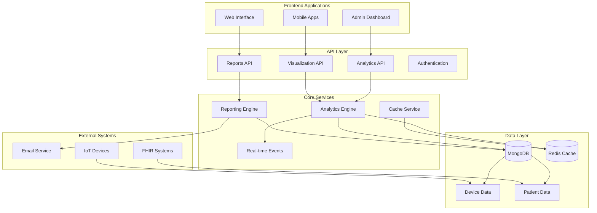

# My FirstCare Analytics System - Comprehensive Documentation

## Overview

The My FirstCare Opera Panel Analytics System is a comprehensive healthcare data analytics platform that provides real-time insights, predictive modeling, data visualization, and automated reporting capabilities for healthcare institutions.

## System Architecture



## System Components

### 1. Analytics Engine (`app/services/analytics.py`)

**Core Healthcare Analytics Service with Advanced Capabilities**

#### Key Features:
- **Patient Statistics**: Demographics, risk analysis, population health
- **Vital Signs Analytics**: Statistical analysis, trend detection, anomaly detection
- **Device Analytics**: Utilization tracking, compliance monitoring
- **Health Risk Predictions**: Multi-factor risk scoring, ML-based predictions
- **Predictive Modeling**: Health event predictions, trend forecasting

#### Analytics Capabilities:
```python
# Patient Analytics
- Total patient counts and demographics
- Age distribution (6 age groups: 0-17, 18-29, 30-44, 45-59, 60-74, 75+)
- Gender distribution and risk categorization
- Active vs inactive patient tracking

# Vital Signs Analytics
- Statistical analysis (mean, median, std dev, min, max)
- Trend detection (increasing, stable, decreasing)
- Anomaly detection using Z-score method (threshold > 2.0)
- Medical threshold categorization
- Time-based aggregation (daily, weekly, monthly, quarterly, yearly)

# Health Risk Assessment
- Multi-factor risk scoring (0.0-1.0 scale)
- Demographic risk factors (age, gender, medical history)
- Vital signs risk analysis (BP, HR, temp, SpO2)
- Predictive health events
- Personalized health recommendations
```

#### Medical Thresholds:
```python
# Blood Pressure Classifications
Normal: 90-120/60-80 mmHg
Elevated: 120-130/80 mmHg  
High: 130-180/80-120 mmHg
Critical: >180/>120 mmHg

# Heart Rate Classifications
Low: <60 bpm
Normal: 60-100 bpm
High: 100-150 bpm
Critical: >150 bpm

# Temperature Classifications
Low: <36.0°C
Normal: 36.0-37.5°C
Fever: 37.5-39.0°C
High Fever: >39.0°C

# SpO2 Classifications
Critical: <90%
Low: 90-95%
Normal: 95-100%
```

### 2. Analytics API (`app/routes/analytics.py`)

**RESTful API endpoints for accessing analytics data**

#### Endpoints:
- `GET /analytics/patients/statistics` - Patient demographics and statistics
- `GET /analytics/vitals/{patient_id}` - Individual patient vital signs analysis
- `GET /analytics/devices/utilization` - Device usage analytics
- `GET /analytics/health-risks/{patient_id}` - Health risk predictions
- `GET /analytics/trends/vitals` - Vital signs trend analysis
- `GET /analytics/anomalies/detect` - Anomaly detection
- `GET /analytics/reports/summary/{report_type}` - Summary reports
- `POST /analytics/export/{format}` - Export analytics data

#### Caching Strategy:
- Patient statistics: 5 minutes
- Vital signs: 3 minutes
- Device analytics: 10 minutes
- Health risks: 5 minutes
- Reports: 30 minutes

### 3. Visualization System (`app/routes/visualization.py`)

**Data visualization endpoints for charts and dashboards**

#### Chart Types Supported:
- **Line Charts**: Time-series vital signs, trends
- **Bar Charts**: Demographics, device utilization
- **Pie/Donut Charts**: Risk distribution, age groups
- **Scatter Plots**: Anomaly detection, correlations
- **Gauge Charts**: Individual risk scores
- **Area Charts**: Cumulative data

#### Chart Data Formats:
```javascript
// Chart.js Compatible Format
{
  "labels": ["2024-01-01", "2024-01-02", ...],
  "datasets": [{
    "label": "Blood Pressure",
    "data": [120, 125, 118, ...],
    "borderColor": "#FF6384",
    "backgroundColor": "rgba(255, 99, 132, 0.1)"
  }]
}

// Universal JSON Structure
{
  "chart_data": { /* Chart.js format */ },
  "statistics": { /* Summary stats */ },
  "thresholds": { /* Medical thresholds */ },
  "chart_type": "line",
  "period": "weekly"
}
```

#### Color Schemes:
```css
/* Risk Level Colors */
Low Risk: #4CAF50 (Green)
Medium Risk: #FFC107 (Amber)  
High Risk: #FF9800 (Orange)
Critical Risk: #F44336 (Red)

/* Chart Colors */
Primary: #36A2EB (Blue)
Secondary: #FF6384 (Pink)
Tertiary: #FFCE56 (Yellow)
Quaternary: #4BC0C0 (Teal)
```

### 4. Reporting Engine (`app/services/reporting_engine.py`)

**Automated report generation with scheduling capabilities**

#### Report Types:
1. **Daily Summary**: Hospital operations overview
2. **Weekly Analytics**: Trend analysis and anomalies  
3. **Patient Report**: Individual health assessment
4. **Hospital Performance**: KPIs and metrics
5. **Risk Assessment**: Population health analysis
6. **System Health**: Technical monitoring
7. **Device Utilization**: Equipment usage stats
8. **Anomaly Alerts**: Real-time issue detection

#### Report Formats:
- **JSON**: Machine-readable data
- **HTML**: Professional web reports
- **CSV**: Spreadsheet-compatible data
- **PDF**: Printable documents (future)
- **Excel**: Native Excel format (future)

#### Scheduling Options:
- **Once**: Single generation
- **Daily**: Midnight UTC
- **Weekly**: Sundays at midnight
- **Monthly**: 1st of month
- **Quarterly**: Every 3 months

### 5. Reports API (`app/routes/reports.py`)

**API for managing report templates and generation**

#### Template Management:
- `POST /reports/templates` - Create report template
- `GET /reports/templates` - List all templates
- `PUT /reports/templates/{id}` - Update template
- `DELETE /reports/templates/{id}` - Delete template

#### Report Generation:
- `POST /reports/generate/{template_id}` - Generate report now
- `GET /reports/jobs` - List generation jobs
- `GET /reports/jobs/{job_id}` - Get job status
- `GET /reports/jobs/{job_id}/output` - Download report

#### Configuration:
- `GET /reports/types` - Available types, formats, frequencies
- `POST /reports/schedule/check` - Manual scheduler trigger

## Data Sources

### Patient Data
```json
{
  "demographics": {
    "age": 45,
    "gender": "female",
    "location": "district_code"
  },
  "medical_history": {
    "conditions": ["hypertension", "diabetes"],
    "medications": ["medication_list"],
    "allergies": ["allergy_list"]
  },
  "vital_signs": {
    "blood_pressure": {"systolic": 120, "diastolic": 80},
    "heart_rate": 72,
    "temperature": 36.8,
    "spo2": 98
  }
}
```

### Device Data
```json
{
  "device_type": "blood_pressure_monitor",
  "patient_id": "ObjectId",
  "timestamp": "2024-01-15T10:30:00Z",
  "data": {
    "systolic": 125,
    "diastolic": 82,
    "heart_rate": 75
  },
  "quality_indicators": {
    "accuracy": "high",
    "confidence": 0.95
  }
}
```

### FHIR Observations
```json
{
  "resourceType": "Observation",
  "status": "final",
  "code": {
    "coding": [{
      "system": "http://loinc.org",
      "code": "85354-9",
      "display": "Blood pressure"
    }]
  },
  "subject": {
    "reference": "Patient/patient-id"
  },
  "valueQuantity": {
    "value": 120,
    "unit": "mmHg"
  }
}
```

## Performance Optimizations

### Caching Strategy
```python
# Redis Cache Configuration
cache_ttl = {
    "patient_stats": 300,      # 5 minutes
    "vital_analytics": 180,    # 3 minutes  
    "device_stats": 600,       # 10 minutes
    "risk_predictions": 300,   # 5 minutes
    "reports": 1800,          # 30 minutes
    "visualization": 300       # 5 minutes
}
```

### Database Indexing
```javascript
// MongoDB Indexes for Analytics
db.patients.createIndex({"hospital_id": 1, "created_at": -1})
db.device_data.createIndex({"patient_id": 1, "timestamp": -1})
db.fhir_observations.createIndex({"subject.reference": 1, "effectiveDateTime": -1})
db.patients.createIndex({"age": 1, "gender": 1, "risk_level": 1})
```

### Query Optimization
- Aggregation pipelines for complex analytics
- Projection to limit data transfer
- Time-based partitioning for large datasets
- Parallel processing for multiple analytics

## Security Implementation

### Authentication & Authorization
```python
# JWT Authentication Required
@router.get("/analytics/patients/statistics")
async def get_patient_statistics(current_user: dict = Depends(get_current_user)):
    # All analytics endpoints require authentication
    pass

# Role-Based Access Control
def check_analytics_access(user_role: str, resource_type: str) -> bool:
    permissions = {
        "viewer": ["read:analytics", "read:reports"],
        "analyst": ["read:analytics", "read:reports", "create:reports"],
        "admin": ["read:analytics", "write:analytics", "admin:reports"]
    }
    return f"read:{resource_type}" in permissions.get(user_role, [])
```

### Data Privacy
- Patient data encryption at rest
- PII anonymization in reports
- Audit logging for all access
- HIPAA compliance measures

### API Security
- Rate limiting (analytics: 100/min)
- Input validation and sanitization
- SQL injection prevention
- XSS protection in reports

## Integration Examples

### Frontend Dashboard Integration
```javascript
// React Analytics Dashboard Component
import { useEffect, useState } from 'react';
import { Chart } from 'chart.js';

function AnalyticsDashboard() {
  const [patientStats, setPatientStats] = useState(null);
  const [vitalTrends, setVitalTrends] = useState(null);
  
  useEffect(() => {
    // Fetch patient statistics
    fetch('/analytics/patients/statistics', {
      headers: { 'Authorization': `Bearer ${token}` }
    })
    .then(res => res.json())
    .then(data => setPatientStats(data.data));
    
    // Fetch visualization data for charts
    fetch('/visualization/charts/system-overview', {
      headers: { 'Authorization': `Bearer ${token}` }
    })
    .then(res => res.json())
    .then(data => setVitalTrends(data.data));
  }, []);
  
  return (
    <div className="analytics-dashboard">
      <MetricsCards metrics={patientStats?.summary} />
      <ChartsSection data={vitalTrends} />
      <ReportsPanel />
    </div>
  );
}
```

### Mobile App Integration
```swift
// iOS Swift Integration
import Foundation

class AnalyticsService {
    private let baseURL = "https://api.my-firstcare.com"
    private let token: String
    
    func fetchPatientRiskScore(patientId: String) async throws -> RiskScore {
        let url = URL(string: "\(baseURL)/analytics/health-risks/\(patientId)")!
        var request = URLRequest(url: url)
        request.setValue("Bearer \(token)", forHTTPHeaderField: "Authorization")
        
        let (data, _) = try await URLSession.shared.data(for: request)
        let response = try JSONDecoder().decode(AnalyticsResponse.self, from: data)
        return response.data.riskScore
    }
}
```

### Python Data Science Integration
```python
# Python Analytics Client
import requests
import pandas as pd
import matplotlib.pyplot as plt

class MyFirstCareAnalytics:
    def __init__(self, api_url, token):
        self.api_url = api_url
        self.headers = {'Authorization': f'Bearer {token}'}
    
    def get_patient_data(self, hospital_id=None):
        """Get patient statistics for analysis"""
        url = f"{self.api_url}/analytics/patients/statistics"
        params = {'hospital_id': hospital_id} if hospital_id else {}
        
        response = requests.get(url, headers=self.headers, params=params)
        return response.json()['data']
    
    def export_analytics_data(self, report_type, format='csv'):
        """Export analytics data for external analysis"""
        url = f"{self.api_url}/analytics/export/{format}"
        params = {'report_type': report_type}
        
        response = requests.post(url, headers=self.headers, params=params)
        return response.json()['data']
    
    def create_visualization(self, data_type, chart_type='line'):
        """Generate visualizations from analytics data"""
        url = f"{self.api_url}/visualization/charts/{data_type}"
        params = {'chart_type': chart_type}
        
        response = requests.get(url, headers=self.headers, params=params)
        chart_data = response.json()['data']['chart_data']
        
        # Convert to pandas and plot
        df = pd.DataFrame({
            'labels': chart_data['labels'],
            'values': chart_data['datasets'][0]['data']
        })
        
        plt.figure(figsize=(10, 6))
        plt.plot(df['labels'], df['values'])
        plt.title(f'{data_type.title()} Analytics')
        plt.xticks(rotation=45)
        plt.tight_layout()
        plt.show()

# Usage Example
analytics = MyFirstCareAnalytics('https://api.my-firstcare.com', 'your-token')
patient_data = analytics.get_patient_data()
analytics.create_visualization('patient-demographics', 'bar')
```

## Monitoring & Observability

### Application Metrics
```python
# Key Performance Indicators
metrics = {
    "api_response_times": {
        "analytics_avg": "125ms",
        "visualization_avg": "89ms", 
        "reports_avg": "2.3s"
    },
    "cache_hit_rates": {
        "patient_stats": "87%",
        "vital_analytics": "92%",
        "device_stats": "79%"
    },
    "report_generation": {
        "success_rate": "99.2%",
        "avg_generation_time": "45s",
        "email_delivery_rate": "98.8%"
    }
}
```

### Health Checks
```bash
# System Health Endpoints
GET /health - Overall system health
GET /analytics/health - Analytics service health  
GET /reports/health - Reporting engine health
GET /visualization/health - Visualization service health
```

### Logging & Alerts
```python
# Structured Logging
logger.info("Analytics query executed", extra={
    "user_id": user_id,
    "query_type": "patient_statistics",
    "execution_time_ms": 125,
    "cache_hit": True,
    "hospital_id": hospital_id
})

# Real-time Alerts
alert_conditions = {
    "high_response_time": "> 2000ms",
    "low_cache_hit_rate": "< 80%", 
    "report_generation_failure": "error_rate > 5%",
    "anomaly_detection": "critical_anomalies > 10"
}
```

## Deployment Architecture

### Production Environment
```yaml
# Docker Compose for Analytics System
version: '3.8'
services:
  analytics-api:
    image: myfirstcare/analytics-api:latest
    replicas: 3
    environment:
      - MONGODB_URI=mongodb://mongo-cluster/analytics
      - REDIS_URI=redis://redis-cluster/0
      - CACHE_ENABLED=true
    
  visualization-api:
    image: myfirstcare/visualization-api:latest
    replicas: 2
    
  reporting-engine:
    image: myfirstcare/reporting-engine:latest
    replicas: 1
    environment:
      - SMTP_SERVER=smtp.hospital.com
      - SMTP_PORT=587
      
  mongodb:
    image: mongo:6.0
    replica_set: analytics-rs
    
  redis:
    image: redis:7.0
    cluster_enabled: true
```

### Scalability Considerations
- Horizontal scaling of API services
- MongoDB sharding for large datasets
- Redis cluster for cache distribution
- Load balancing with health checks
- Auto-scaling based on metrics

## Future Roadmap

### Phase 1: Enhanced Analytics (Q2 2024)
- Machine learning model integration
- Advanced predictive analytics
- Real-time streaming analytics
- Custom metric definitions

### Phase 2: Advanced Visualization (Q3 2024)
- Interactive dashboards
- Real-time chart updates
- Custom visualization builder
- 3D visualizations for complex data

### Phase 3: AI Integration (Q4 2024)
- Natural language querying
- Automated insight generation
- Anomaly explanation AI
- Predictive health alerts

### Phase 4: Platform Expansion (Q1 2025)
- Multi-tenant architecture
- API marketplace
- Third-party integrations
- Mobile SDK

## Conclusion

The My FirstCare Analytics System provides a comprehensive, scalable, and secure platform for healthcare data analytics. With its modular architecture, extensive API coverage, and robust reporting capabilities, it enables healthcare institutions to gain valuable insights from their data while maintaining the highest standards of security and compliance.

The system is designed to grow with organizational needs, supporting everything from small clinics to large hospital networks, and provides the foundation for data-driven healthcare decision making. 