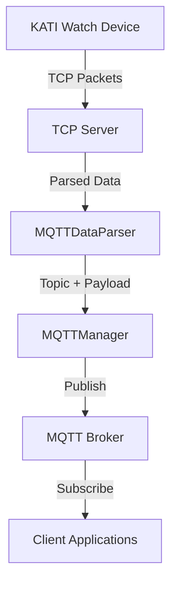

# KATI Watch MQTT Parser and Manager Documentation

## Overview

The KATI Watch MQTT system consists of two main components:

- **MQTTDataParser**: Converts parsed packet data to MQTT JSON format
- **MQTTManager**: Handles MQTT connections, publishing, and subscription management

This system processes various packet types from KATI watches and publishes them to appropriate MQTT topics for real-time monitoring and data analysis.

## Architecture



## MQTTDataParser Class

### Purpose
Converts parsed KATI watch packet data into structured JSON payloads and determines the appropriate MQTT topic for each message type.

### Key Features
- **Packet Type Routing**: Maps different packet types to specific MQTT topics
- **Data Transformation**: Converts raw packet data to standardized JSON format
- **Location Processing**: Handles GPS, WiFi, and LBS location data
- **Health Data Parsing**: Processes vital signs, sleep data, and device status
- **Emergency Alert Handling**: Manages SOS and fall detection alerts

### Supported Packet Types & Topics

| Packet Type | MQTT Topic | Purpose | Trigger |
|-------------|------------|---------|---------|
| `AP03` | `iMEDE_watch/hb` | Heartbeat/Status | Regular intervals, device status updates |
| `APHP+AP03+AP01+AP02` | `iMEDE_watch/VitalSign` | Vital Signs | Health measurements, monitoring sessions |
| `AP55` | `iMEDE_watch/AP55` | Batch Health Data | Historical data upload, sync operations |
| `AP01+AP02` | `iMEDE_watch/location` | Location Data | GPS updates, location requests |
| `AP97` | `iMEDE_watch/sleepdata` | Sleep Analysis | Sleep period completion, data upload |
| `AP10 (alarm_state='01')` | `iMEDE_watch/sos` | SOS Emergency | SOS button press, manual emergency |
| `AP10 (alarm_state='05'/'06')` | `iMEDE_watch/fallDown` | Fall Detection | Accelerometer fall detection |

### Core Methods

#### `parse_packet_to_mqtt(parsed_packet: Dict[str, Any]) -> Optional[Dict[str, Any]]`
Main entry point for packet processing.

**Parameters:**
- `parsed_packet`: Dictionary containing parsed packet data from the TCP server

**Returns:**
- Dictionary with `topic` and `payload` keys, or None if packet type not supported

**Example:**
```python
parser = MQTTDataParser()
result = parser.parse_packet_to_mqtt({
    'type': 'AP03',
    'IMEI': '865067123456789',
    'battery_level': 67,
    'signal_strength': 80
})
# Returns: {'topic': 'iMEDE_watch/hb', 'payload': '{"IMEI": "865067123456789", ...}'}
```

### Packet-Specific Parsers

#### 1. Heartbeat Parser (`_parse_ap03_heartbeat`)
**Topic:** `iMEDE_watch/hb`

**Payload Structure:**
```json
{
    "IMEI": "865067123456789",
    "signalGSM": 80,
    "battery": 67,
    "satellites": 4,
    "workingMode": 2,
    "timeStamps": "16/06/2025 12:30:45",
    "step": 999
}
```

#### 2. Vital Signs Parser (`_parse_vital_signs`)
**Topic:** `iMEDE_watch/VitalSign`

**Payload Structure:**
```json
{
    "IMEI": "865067123456789",
    "heartRate": 72,
    "bloodPressure": {
        "bp_sys": 122,
        "bp_dia": 74
    },
    "bodyTemperature": 36.6,
    "spO2": 97,
    "signalGSM": 80,
    "battery": 67,
    "location": {
        "GPS": {"latitude": 22.5678, "longitude": 112.3456},
        "WiFi": "[{...}]",
        "LBS": {"MCC": "520", "MNC": "3", "LAC": "1815", "CID": "79474300"}
    },
    "timeStamps": "16/06/2025 12:30:45"
}
```

#### 3. AP55 Dataset Parser (`_parse_ap55_dataset`)
**Topic:** `iMEDE_watch/AP55`

**Payload Structure:**
```json
{
    "IMEI": "865067123456789",
    "location": {...},
    "timeStamps": "16/06/2025 12:30:45",
    "num_datas": 12,
    "data": [
        {
            "timestamp": 1738331256,
            "heartRate": 84,
            "bloodPressure": {"bp_sys": 119, "bp_dia": 73},
            "spO2": 98,
            "bodyTemperature": 36.9
        }
    ]
}
```

#### 4. Location Parser (`_parse_location`)
**Topic:** `iMEDE_watch/location`

**Payload Structure:**
```json
{
    "IMEI": "865067123456789",
    "location": {
        "GPS": {
            "latitude": 22.5678,
            "longitude": 112.3456,
            "speed": 0.0,
            "header": 180.0
        },
        "WiFi": "[{'SSID':'WiFi1','MAC':'aa-bb-cc-dd-ee-ff','RSSI':'87'}]",
        "LBS": {
            "MCC": "520",
            "MNC": "3", 
            "LAC": "1815",
            "CID": "79474300",
            "SetBase": "[{...}]"
        }
    }
}
```

#### 5. Sleep Data Parser (`_parse_sleep_data`)
**Topic:** `iMEDE_watch/sleepdata`

**Payload Structure:**
```json
{
    "IMEI": "865067123456789",
    "sleep": {
        "timeStamps": "16/06/2025 01:00:00",
        "time": "2200@0700",
        "data": "0000000111110000010011111110011111111111110000000002200000001111111112111100111001111111211111111222111111111110110111111110110111111011112201110",
        "num": 145
    }
}
```

#### 6. Emergency Alarm Parser (`_parse_emergency_alarm`)
**Topics:** `iMEDE_watch/sos` or `iMEDE_watch/fallDown`

**SOS Payload:**
```json
{
    "status": "SOS",
    "location": {...},
    "IMEI": "865067123456789"
}
```

**Fall Detection Payload:**
```json
{
    "status": "FALL DOWN",
    "location": {...},
    "IMEI": "865067123456789"
}
```

### AP10 Alarm State Mapping (CORRECTED)

The system correctly identifies alarm types using the `alarm_state` field:

| Alarm State Code | Type | MQTT Topic | Description |
|------------------|------|------------|-------------|
| `'00'` | Normal | None | No alarm - no MQTT message sent |
| `'01'` | SOS | `iMEDE_watch/sos` | SOS emergency button pressed |
| `'03'` | Not Wear | `iMEDE_watch/sos` | Device not worn (default topic) |
| `'05'` | Fall Down | `iMEDE_watch/fallDown` | Fall detection triggered |
| `'06'` | Fall Down | `iMEDE_watch/fallDown` | Fall detection triggered |

**Implementation:**
```python
def _parse_emergency_alarm(self, parsed_packet: Dict[str, Any], imei: str) -> Dict[str, Any]:
    # Use alarm_state info from the packet parser
    alarm_state_info = parsed_packet.get('alarm_state', {})
    alarm_type = alarm_state_info.get('type', 'UNKNOWN')
    
    # Determine status and topic based on alarm state type
    if alarm_type == 'fall_down':
        status = "FALL DOWN"
        topic = f"{self.topic_prefix}/fallDown"
    elif alarm_type == 'SOS':
        status = "SOS"
        topic = f"{self.topic_prefix}/sos"
    else:
        status = alarm_type.upper()
        topic = f"{self.topic_prefix}/sos"  # Default to SOS topic
```

## MQTTManager Class

### Purpose
Manages MQTT broker connections, message publishing, and subscription handling with enhanced reliability and error recovery.

### Key Features
- **Automatic Reconnection**: Handles connection failures with exponential backoff
- **Message Queuing**: Buffers messages when disconnected
- **Connection Monitoring**: Tracks connection status and health
- **QoS Management**: Configurable Quality of Service levels
- **Async Support**: Non-blocking operations for high-performance integration

### Configuration
```python
# MQTT Configuration (from config)
mqtt:
  enabled: true
  host: "mqtt.example.com"
  port: 1883
  username: "kati_user"
  password: "secure_password"
  keepalive: 60
  qos: 1
  retain: false
  connection_timeout: 10
  reconnect_delay: 5
  max_reconnect_delay: 300
```

### Core Methods

#### `async connect()`
Establishes connection to MQTT broker with retry logic.

**Features:**
- Exponential backoff on failures
- Connection status tracking
- Automatic keepalive management

#### `async publish_parsed_data(parsed_packet: Dict[str, Any], client_info: Dict[str, Any] = None)`
Main method for publishing device data.

**Parameters:**
- `parsed_packet`: Parsed packet data from TCP server
- `client_info`: Optional client connection information

**Process:**
1. Uses MQTTDataParser to convert packet to MQTT format
2. Publishes to appropriate topic
3. Handles connection failures gracefully
4. Logs all operations for monitoring

**Example:**
```python
mqtt_manager = MQTTManager()
await mqtt_manager.connect()

# Publish heartbeat data
await mqtt_manager.publish_parsed_data({
    'type': 'AP03',
    'IMEI': '865067123456789',
    'battery_level': 67,
    'signal_strength': 80
})
```

#### `async publish_device_status(imei: str, status: str, client_info: Dict[str, Any] = None)`
Publishes device online/offline status.

**Topic:** `iMEDE_watch/onlineTrigger`

**Payload:**
```json
{
    "IMEI": "865067123456789",
    "status": "online"  // or "offline"
}
```

#### `async publish_command_response(imei: str, command: str, response: str)`
Publishes command acknowledgments from devices.

**Topic:** `iMEDE_watch/command_res`

### Connection Management

#### Connection States
- **CONNECTED**: Successfully connected to broker
- **DISCONNECTED**: Not connected, attempting reconnection
- **CONNECTING**: Connection attempt in progress
- **ERROR**: Persistent connection failure

#### Retry Logic
```python
# Exponential backoff calculation
delay = min(self.reconnect_delay * (2 ** self.retry_count), self.max_reconnect_delay)
```

#### Health Monitoring
- Regular ping/pong to verify connection
- Connection timeout detection
- Automatic recovery procedures

### Message Flow Examples

#### 1. Heartbeat Message Flow
```
KATI Watch → TCP Server → MQTTDataParser → MQTTManager → MQTT Broker
AP03 packet → Parsed data → iMEDE_watch/hb + JSON payload → Published
```

#### 2. Emergency Alert Flow
```
KATI Watch (SOS pressed) → TCP Server → MQTTDataParser → MQTTManager → MQTT Broker
AP10 (alarm_state='01') → Parsed data → iMEDE_watch/sos + JSON payload → Published
```

#### 3. Vital Signs Flow
```
KATI Watch (health measurement) → TCP Server → MQTTDataParser → MQTTManager → MQTT Broker  
APHP+AP03+AP01+AP02 → Parsed data → iMEDE_watch/VitalSign + JSON payload → Published
```

## Error Handling

### Parser Errors
- Invalid packet format handling
- Missing field fallbacks
- Type conversion safety
- Comprehensive logging

### Manager Errors
- Connection failure recovery
- Message publishing failures
- Broker disconnection handling
- Network timeout management

### Logging Strategy
```python
# Critical alarms
logger.critical(f"CRITICAL ALARM - SOS: Emergency from IMEI {imei}")

# Connection events
logger.info(f"MQTT connected to {host}:{port}")

# Publishing events
logger.debug(f"Published to {topic}: {payload}")

# Error conditions
logger.error(f"MQTT publish failed: {error}")
```

## Integration Points

### TCP Server Integration
```python
# In TCP message handler
if parsed_packet:
    await mqtt_manager.publish_parsed_data(parsed_packet, client_info)
```

### Connection Monitoring Integration
```python
# Device online/offline detection
await mqtt_manager.publish_device_status(imei, "online", client_info)
await mqtt_manager.publish_device_status(imei, "offline", client_info)
```

### Command System Integration
```python
# Command acknowledgment
await mqtt_manager.publish_command_response(imei, command, "Server accept")
```

## Performance Considerations

### Optimization Features
- **Async Operations**: Non-blocking MQTT operations
- **Connection Pooling**: Reused connections for efficiency
- **Message Batching**: Grouped messages when possible
- **Selective Publishing**: Only publishes relevant packet types

### Monitoring Metrics
- Connection uptime percentage
- Message publishing success rate
- Average publishing latency
- Error rate by message type

## Security Features

### Authentication
- Username/password authentication
- TLS/SSL encryption support
- Certificate-based authentication (configurable)

### Topic Security
- Namespace isolation (`iMEDE_watch/*`)
- Client ID management
- Access control integration ready

## Troubleshooting

### Common Issues
1. **Connection Failures**: Check broker availability and credentials
2. **Message Not Published**: Verify topic permissions and payload format
3. **High Latency**: Check network conditions and broker load
4. **Memory Leaks**: Monitor connection cleanup and message buffering

### Debug Commands
```python
# Enable debug logging
logger.setLevel(logging.DEBUG)

# Test connection
await mqtt_manager.test_connection()

# Validate message format
result = mqtt_parser.parse_packet_to_mqtt(test_packet)
```

## Future Enhancements

### Planned Features
- Message encryption at application level
- Advanced QoS management per topic
- Message deduplication
- Enhanced monitoring dashboard integration
- Load balancing across multiple brokers

### Scalability Improvements
- Connection pooling for multiple brokers
- Message routing optimization
- Batch processing capabilities
- Horizontal scaling support

---

This documentation provides a comprehensive overview of the KATI Watch MQTT Parser and Manager system, including corrected AP10 alarm identification logic and detailed implementation examples.
