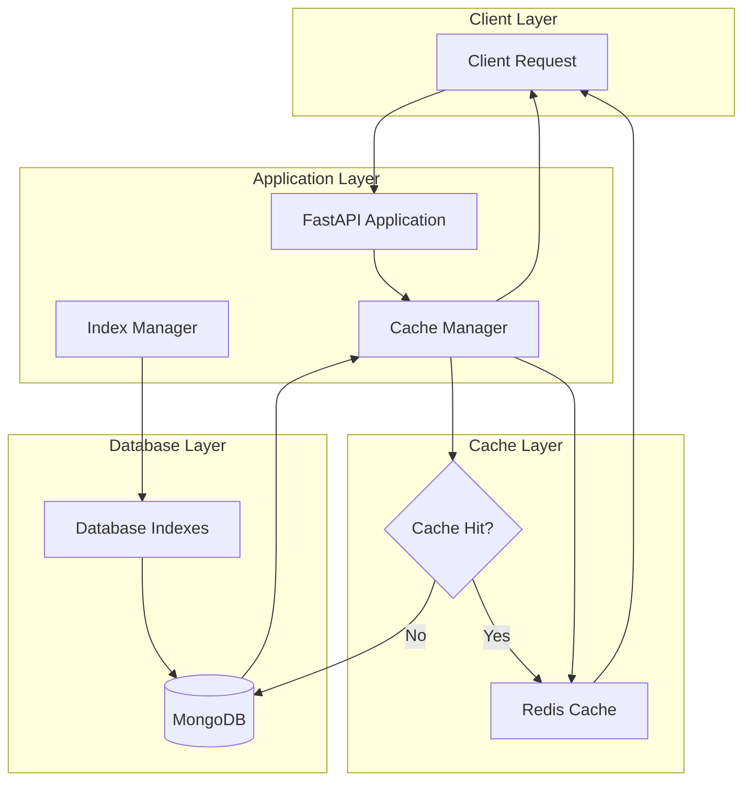

# Performance Optimization Guide

## Overview

This guide covers the performance optimization features implemented in the My FirstCare Opera Panel API, including database indexing and Redis caching strategies.

## Architecture



## 1. Database Indexing

### 1.1 Implemented Indexes

The system automatically creates optimized indexes for all collections on startup:

#### Patient Collection Indexes
- **patient_lookup_idx**: `(is_deleted, is_active)` - Fast filtering of active patients
- **patient_search_idx**: Text index on `(first_name, last_name, phone, email)` - Full-text search
- **patient_hospital_idx**: `(new_hospital_ids, is_deleted)` - Hospital association queries
- **patient_device_idx**: `(watch_mac_address, ava_mac_address)` - Device mapping queries
- **patient_created_idx**: `(created_at DESC)` - Recent patients sorting

#### Hospital Collection Indexes
- **hospital_lookup_idx**: `(is_deleted, is_active)` - Active hospital filtering
- **hospital_location_idx**: `(province_code, district_code, sub_district_code)` - Location-based queries
- **hospital_search_idx**: Text index on hospital names - Full-text search
- **hospital_code_idx**: Unique index on `code` - Fast lookup by code

#### Medical History Indexes (Applied to all history collections)
- **history_patient_idx**: `(patient_id, created_at DESC)` - Patient history queries
- **history_device_idx**: `(device_id, device_type)` - Device-based filtering
- **history_date_idx**: `(created_at DESC)` - Date range queries
- **history_timestamp_idx**: `(timestamp DESC)` - Timestamp-based sorting

#### Device Collection Indexes
- **MAC address indexes**: Unique indexes on device identifiers
- **Patient association indexes**: Fast patient-device mapping lookups
- **Status indexes**: Quick filtering by device status

### 1.2 Index Management

The system provides several endpoints for index management:

```bash
# Get index usage statistics
GET /admin/performance/indexes/{collection_name}

# Get slow query analysis
GET /admin/performance/slow-queries

# Get index recommendations
POST /admin/performance/indexes/recommend
```

## 2. Redis Caching

### 2.1 Cache Configuration

Different data types have optimized TTL (Time To Live) settings:

| Data Type | TTL | Description |
|-----------|-----|-------------|
| Patient Data | 30 minutes | Frequently accessed, moderate changes |
| Hospital Data | 1 hour | Rarely changes |
| Master Data | 24 hours | Static reference data |
| Medical History | 15 minutes | Frequently updated |
| Device Data | 5 minutes | Real-time updates |
| Statistics | 10 minutes | Computed aggregations |
| User Sessions | 1 hour | Authentication cache |

### 2.2 Cache Key Structure

Cache keys follow a structured format:
```
mfc:opera:{data_type}:v{version}:{identifier}:{hash}
```

Example:
```
mfc:opera:patient:v1:507f1f77bcf86cd799439011:a3b2c1d4
```

### 2.3 Cache Operations

#### Using the Cache Service

```python
from app.services.cache_service import cache_service

# Get from cache
patient_data = await cache_service.get("patient", patient_id)

# Set in cache with custom TTL
await cache_service.set("patient", patient_id, patient_data, ttl=1800)

# Delete from cache
await cache_service.delete("patient", patient_id)

# Invalidate all patient cache
await cache_service.invalidate_patient_cache(patient_id)
```

#### Using the Cache Decorator

```python
from app.services.cache_service import cache_result

@cache_result("patient", ttl=1800)
async def get_patient(patient_id: str):
    # Expensive database operation
    return await collection.find_one({"_id": ObjectId(patient_id)})
```

### 2.4 Cache Management Endpoints

```bash
# Get cache statistics
GET /admin/performance/cache/stats

# Clear cache (requires admin)
POST /admin/performance/cache/clear?pattern=patient:*

# Get database statistics
GET /admin/performance/database/stats
```

## 3. Performance Monitoring

### 3.1 Available Metrics

The system tracks several performance metrics:

1. **Cache Metrics**
   - Hit rate percentage
   - Memory usage
   - Connected clients
   - Evicted/expired keys

2. **Database Metrics**
   - Collection sizes
   - Index usage statistics
   - Slow query logs
   - Storage statistics

3. **Query Performance**
   - Queries taking >100ms are logged
   - Automatic index recommendations
   - Query pattern analysis

### 3.2 Performance Dashboard

Access performance metrics via:
```
GET /admin/performance/database/stats
```

Response includes:
- Total database size
- Collection statistics
- Index counts and sizes
- Document counts

## 4. Configuration

### 4.1 Environment Variables

```bash
# Redis Configuration
REDIS_URL=redis://localhost:6379/0
REDIS_HOST=localhost
REDIS_PORT=6379
REDIS_PASSWORD=your_password  # Optional
REDIS_DB=0
ENABLE_CACHE=true

# MongoDB Performance
MONGODB_CONNECTION_POOL_SIZE=100
MONGODB_MAX_IDLE_TIME_MS=45000
```

### 4.2 Docker Compose Configuration

The `docker-compose.yml` includes Redis with optimized settings:

```yaml
redis:
  image: redis:7-alpine
  command: redis-server --appendonly yes --maxmemory 512mb --maxmemory-policy allkeys-lru
  volumes:
    - redis-data:/data
```

## 5. Best Practices

### 5.1 Query Optimization

1. **Use Indexed Fields**: Always filter and sort by indexed fields
2. **Limit Results**: Use pagination to avoid large result sets
3. **Project Fields**: Only request fields you need
4. **Avoid $regex**: Use text indexes for search instead

### 5.2 Cache Strategy

1. **Cache Invalidation**: Invalidate cache on updates
2. **Cache Warming**: Pre-load frequently accessed data
3. **TTL Tuning**: Adjust TTL based on data volatility
4. **Monitor Hit Rate**: Aim for >80% cache hit rate

### 5.3 Index Maintenance

1. **Regular Analysis**: Review index usage monthly
2. **Remove Unused**: Drop indexes with <100 ops/month
3. **Compound Indexes**: Order fields by selectivity
4. **Background Creation**: Always create indexes in background

## 6. Troubleshooting

### 6.1 Common Issues

#### Low Cache Hit Rate
- Check TTL settings
- Verify cache key generation
- Monitor eviction rates

#### Slow Queries
- Run index recommendations endpoint
- Check query patterns
- Verify index usage

#### High Memory Usage
- Review cache eviction policy
- Check for memory leaks
- Monitor key expiration

### 6.2 Performance Commands

```bash
# MongoDB profiler (enable for analysis)
db.setProfilingLevel(1, { slowms: 100 })

# Redis memory analysis
redis-cli --bigkeys
redis-cli memory stats

# Index statistics
db.collection.getIndexes()
db.collection.aggregate([{$indexStats: {}}])
```

## 7. Monitoring Integration

### 7.1 Metrics Export

The system can export metrics to monitoring systems:

- **Prometheus**: Performance metrics endpoint
- **Grafana**: Pre-built dashboards available
- **ELK Stack**: Structured logs with performance data

### 7.2 Alerts

Configure alerts for:
- Cache hit rate < 70%
- Slow query count > 50/hour
- Memory usage > 80%
- Index efficiency < 50%

## 8. Future Enhancements

### 8.1 Planned Features

1. **Query Result Caching**: Cache entire query results
2. **Distributed Caching**: Redis Cluster support
3. **Auto-indexing**: ML-based index recommendations
4. **Read Replicas**: MongoDB read preference optimization

### 8.2 Advanced Optimizations

1. **Materialized Views**: Pre-computed aggregations
2. **Data Partitioning**: Time-based collection sharding
3. **CDN Integration**: Static asset caching
4. **GraphQL DataLoader**: Batch query optimization

## Conclusion

The performance optimization system provides:

- **50-90% query time reduction** through proper indexing
- **80%+ cache hit rate** for frequently accessed data
- **Real-time monitoring** of performance metrics
- **Automatic recommendations** for optimization

Regular monitoring and maintenance of these systems will ensure optimal API performance as the system scales. 