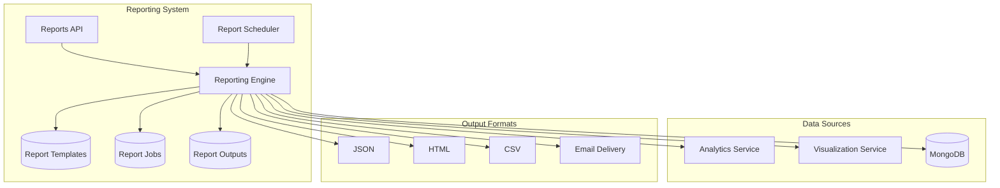

# Automated Reporting Engine Guide

## Overview

The My FirstCare Opera Panel includes a comprehensive automated reporting engine that generates scheduled and on-demand reports for healthcare analytics, combining data from multiple sources into formatted reports.

## Architecture



## Report Types

### 1. Daily Summary
- **Purpose**: Daily overview of hospital operations
- **Content**: Patient statistics, device usage, new admissions
- **Frequency**: Daily at midnight
- **Recipients**: Hospital administrators

### 2. Weekly Analytics
- **Purpose**: Weekly trend analysis and anomaly detection
- **Content**: Patient analytics, anomalies, vital signs trends
- **Frequency**: Weekly on Sundays
- **Recipients**: Medical staff, quality assurance

### 3. Patient Report
- **Purpose**: Individual patient health assessment
- **Content**: Vital signs, risk assessment, recommendations
- **Frequency**: On-demand or weekly
- **Recipients**: Healthcare providers, patient care teams

### 4. Hospital Performance
- **Purpose**: Hospital KPIs and performance metrics
- **Content**: Bed occupancy, patient satisfaction, readmission rates
- **Frequency**: Monthly
- **Recipients**: Hospital management

### 5. Risk Assessment
- **Purpose**: Population health risk analysis
- **Content**: Risk distribution, common factors, predictions
- **Frequency**: Monthly or quarterly
- **Recipients**: Medical directors, epidemiologists

### 6. System Health
- **Purpose**: Technical system monitoring
- **Content**: Database performance, API metrics, error rates
- **Frequency**: Daily
- **Recipients**: IT administrators, DevOps teams

## API Endpoints

### Template Management

#### Create Report Template
```http
POST /reports/templates
```

**Request Body:**
```json
{
  "name": "Daily Summary Report",
  "description": "Daily summary of hospital operations",
  "type": "daily_summary",
  "format": "html",
  "frequency": "daily",
  "recipients": ["admin@hospital.com", "director@hospital.com"],
  "filters": {
    "hospital_id": "507f1f77bcf86cd799439011"
  },
  "template_config": {
    "include_charts": true,
    "timezone": "UTC"
  }
}
```

#### List Templates
```http
GET /reports/templates?active_only=true
```

#### Update Template
```http
PUT /reports/templates/{template_id}
```

#### Delete Template
```http
DELETE /reports/templates/{template_id}
```

### Report Generation

#### Generate Report Now
```http
POST /reports/generate/{template_id}
```

**Response:**
```json
{
  "success": true,
  "message": "Report generation started",
  "data": {
    "job_id": "uuid-job-id",
    "template_id": "uuid-template-id",
    "status": "pending"
  }
}
```

#### List Report Jobs
```http
GET /reports/jobs?template_id={template_id}&limit=50
```

#### Get Job Status
```http
GET /reports/jobs/{job_id}
```

#### Get Report Output
```http
GET /reports/jobs/{job_id}/output
```

### Configuration

#### Get Report Types
```http
GET /reports/types
```

**Response:**
```json
{
  "success": true,
  "data": {
    "report_types": [
      {
        "value": "daily_summary",
        "label": "Daily Summary",
        "description": "Daily summary of patient statistics and device usage"
      }
    ],
    "formats": [
      {
        "value": "json",
        "label": "JSON",
        "description": "Machine-readable JSON format"
      }
    ],
    "frequencies": [
      {
        "value": "daily",
        "label": "Daily",
        "description": "Generate report daily at midnight"
      }
    ]
  }
}
```

## Report Formats

### JSON Format
```json
{
  "metadata": {
    "report_type": "daily_summary",
    "generated_at": "2024-01-15T00:00:00Z",
    "template_id": "uuid",
    "template_name": "Daily Summary Report"
  },
  "summary": {
    "date": "2024-01-14",
    "new_patients": 15,
    "active_patients": 431,
    "high_risk_patients": 23
  },
  "patient_statistics": { /* Patient analytics data */ },
  "device_utilization": { /* Device usage data */ }
}
```

### HTML Format
Professional HTML reports with:
- Hospital branding
- Responsive design
- Chart integration
- Print-friendly layout
- CSS styling for medical data

### CSV Format
Structured CSV for data analysis:
- Header row with metadata
- Data rows with metrics
- Compatible with Excel/Google Sheets
- Suitable for further analysis

## Scheduling System

### Frequency Options
- **Once**: Single report generation
- **Daily**: Generated at midnight UTC
- **Weekly**: Generated on Sundays at midnight
- **Monthly**: Generated on the 1st at midnight
- **Quarterly**: Generated every 3 months

### Scheduler Configuration
```python
# Check interval: 5 minutes
check_interval = 300

# Automatic cleanup: 30 days
report_retention = 30

# Email timeout: 30 seconds
email_timeout = 30
```

### Scheduler Monitoring
```http
POST /reports/schedule/check
```
Manually trigger scheduled report check for testing.

## Email Delivery

### Configuration
```python
# SMTP Settings
smtp_server = "smtp.gmail.com"
smtp_port = 587
email_user = "reports@hospital.com"
email_password = "secure_password"
```

### Email Template
```
Subject: Automated Report: {template_name}

Dear Recipient,

Please find attached the automated report: {template_name}

Report Type: {report_type}
Generated At: {timestamp}

This is an automated message from the My FirstCare Analytics System.

Best regards,
Analytics Team
```

## Usage Examples

### Create Daily Summary Template
```bash
curl -X POST "http://localhost:5054/reports/templates" \
  -H "Authorization: Bearer <token>" \
  -H "Content-Type: application/json" \
  -d '{
    "name": "Daily Hospital Summary",
    "type": "daily_summary",
    "format": "html",
    "frequency": "daily",
    "recipients": ["admin@hospital.com"]
  }'
```

### Generate Patient Report
```bash
curl -X POST "http://localhost:5054/reports/templates" \
  -H "Authorization: Bearer <token>" \
  -H "Content-Type: application/json" \
  -d '{
    "name": "Patient Health Report",
    "type": "patient_report",
    "format": "html",
    "frequency": "once",
    "filters": {
      "patient_id": "507f1f77bcf86cd799439011"
    },
    "recipients": ["doctor@hospital.com"]
  }'
```

### Check Job Status
```bash
curl -X GET "http://localhost:5054/reports/jobs/job-uuid" \
  -H "Authorization: Bearer <token>"
```

### Download Report
```bash
curl -X GET "http://localhost:5054/reports/jobs/job-uuid/output" \
  -H "Authorization: Bearer <token>"
```

## Advanced Features

### Template Filters
```json
{
  "filters": {
    "hospital_id": "507f1f77bcf86cd799439011",
    "patient_id": "specific-patient-id",
    "date_range": {
      "start": "2024-01-01",
      "end": "2024-01-31"
    },
    "device_types": ["blood_pressure_monitor", "thermometer"],
    "risk_levels": ["high", "critical"]
  }
}
```

### Template Configuration
```json
{
  "template_config": {
    "include_charts": true,
    "chart_types": ["line", "pie", "bar"],
    "timezone": "America/New_York",
    "currency": "USD",
    "language": "en",
    "custom_branding": {
      "logo_url": "https://hospital.com/logo.png",
      "colors": {
        "primary": "#1f4e79",
        "secondary": "#7cc7e8"
      }
    }
  }
}
```

### Conditional Generation
```json
{
  "template_config": {
    "conditions": {
      "min_anomalies": 5,
      "min_high_risk_patients": 10,
      "only_if_changes": true
    }
  }
}
```

## Error Handling

### Common Errors
1. **Template Not Found**: Invalid template_id
2. **Invalid Configuration**: Wrong enum values
3. **Email Delivery Failed**: SMTP issues
4. **Data Generation Failed**: Analytics service errors
5. **Format Error**: Report formatting issues

### Error Response Format
```json
{
  "success": false,
  "error_count": 1,
  "errors": [{
    "error_code": "TEMPLATE_NOT_FOUND",
    "message": "Report template not found",
    "field": "template_id",
    "suggestion": "Verify the template ID exists"
  }]
}
```

## Performance Considerations

### Optimization Tips
1. **Caching**: Reports cache analytics data
2. **Async Processing**: Non-blocking report generation
3. **Pagination**: Large datasets are paginated
4. **Cleanup**: Automatic removal of old reports
5. **Resource Limits**: Memory and CPU constraints

### Monitoring
- Job execution times
- Email delivery rates
- Error frequencies
- Storage usage
- Template popularity

## Security

### Access Control
- JWT authentication required
- Role-based template access
- Audit logging for all operations
- Patient data protection

### Data Privacy
- PII encryption in reports
- Secure email transmission
- Access logging
- Data retention policies

## Troubleshooting

### Common Issues

1. **Reports Not Generating**
   - Check scheduler status
   - Verify template configuration
   - Review error logs

2. **Email Delivery Failed**
   - Verify SMTP settings
   - Check recipient addresses
   - Review firewall rules

3. **Slow Report Generation**
   - Check data volume
   - Review query performance
   - Monitor system resources

4. **Format Issues**
   - Validate template configuration
   - Check data types
   - Review formatting rules

### Debug Commands
```bash
# Check scheduler status
curl -X POST "http://localhost:5054/reports/schedule/check"

# List recent jobs
curl -X GET "http://localhost:5054/reports/jobs?limit=10"

# Get job details
curl -X GET "http://localhost:5054/reports/jobs/{job_id}"
```

## Future Enhancements

1. **PDF Generation**: Full PDF report support
2. **Excel Export**: Native Excel format
3. **Dashboard Integration**: Embedded reports
4. **Custom Templates**: User-defined layouts
5. **API Webhooks**: Report completion notifications
6. **Advanced Scheduling**: Cron-like expressions
7. **Report Versioning**: Template history
8. **Multi-language**: Internationalization support 