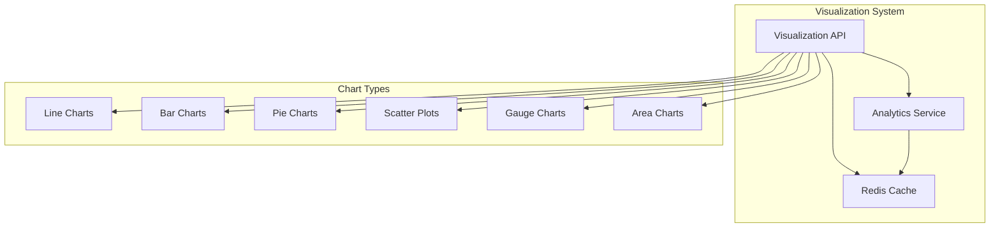

# Visualization Implementation Guide

## Overview

The My FirstCare Opera Panel now includes comprehensive data visualization endpoints that format analytics data for various chart types, enabling rich dashboard experiences.

## Architecture



## API Endpoints

### Patient Demographics Chart
```http
GET /visualization/charts/patient-demographics
```
- **Parameters**:
  - `hospital_id` (optional): Filter by hospital
  - `chart_type`: bar, pie, donut
- **Response**: Age and gender distribution formatted for charts
- **Cache**: 10 minutes

### Vital Signs Trends
```http
GET /visualization/charts/vital-trends/{patient_id}
```
- **Parameters**:
  - `vital_type` (required): Type of vital sign
  - `days`: Number of days to display (1-90)
  - `chart_type`: line, area
- **Response**: Time-series data with thresholds
- **Cache**: 3 minutes

### Risk Distribution
```http
GET /visualization/charts/risk-distribution
```
- **Parameters**:
  - `hospital_id` (optional): Filter by hospital
  - `chart_type`: pie, donut, bar
- **Response**: Patient risk levels with color coding
- **Cache**: 5 minutes

### Device Utilization
```http
GET /visualization/charts/device-utilization
```
- **Parameters**:
  - `hospital_id` (optional): Filter by hospital
  - `period`: Analysis period
  - `chart_type`: bar, line, area
- **Response**: Device usage and compliance rates
- **Cache**: 10 minutes

### Anomaly Scatter Plot
```http
GET /visualization/charts/anomaly-scatter/{patient_id}
```
- **Parameters**:
  - `vital_type` (required): Type of vital sign
  - `days`: Analysis period (1-90)
- **Response**: Normal vs anomalous readings scatter plot
- **No cache** (real-time data)

### Risk Gauge
```http
GET /visualization/charts/risk-gauge/{patient_id}
```
- **Parameters**: None
- **Response**: Patient risk score formatted for gauge chart
- **Cache**: 5 minutes

### System Overview Dashboard
```http
GET /visualization/charts/system-overview
```
- **Parameters**: None
- **Response**: Key metrics and mini-charts for dashboard
- **Cache**: 5 minutes

## Chart Data Formats

### Line/Area Charts
```json
{
  "labels": ["2024-01-01", "2024-01-02", ...],
  "datasets": [{
    "label": "Dataset Name",
    "data": [120, 125, 118, ...],
    "borderColor": "#36A2EB",
    "backgroundColor": "rgba(54, 162, 235, 0.1)",
    "tension": 0.4,
    "fill": true
  }]
}
```

### Bar Charts
```json
{
  "labels": ["Category 1", "Category 2", ...],
  "datasets": [{
    "label": "Dataset Name",
    "data": [45, 67, 23, ...],
    "backgroundColor": "#36A2EB",
    "borderWidth": 1
  }]
}
```

### Pie/Donut Charts
```json
{
  "labels": ["Slice 1", "Slice 2", ...],
  "datasets": [{
    "data": [300, 150, 100, ...],
    "backgroundColor": ["#FF6384", "#36A2EB", "#FFCE56"],
    "borderWidth": 2,
    "borderColor": "#fff"
  }]
}
```

### Scatter Plots
```json
{
  "datasets": [{
    "label": "Normal Readings",
    "data": [{"x": "2024-01-01T10:00:00", "y": 120}, ...],
    "backgroundColor": "#36A2EB",
    "pointRadius": 3
  }, {
    "label": "Anomalies",
    "data": [{"x": "2024-01-01T14:00:00", "y": 180, "z_score": 3.2}, ...],
    "backgroundColor": "#FF6384",
    "pointRadius": 6,
    "pointStyle": "triangle"
  }]
}
```

### Gauge Charts
```json
{
  "value": 67.5,
  "min": 0,
  "max": 100,
  "title": "Health Risk Score",
  "label": "%",
  "thresholds": {
    "0": {"color": "#4CAF50", "label": "Low"},
    "30": {"color": "#FFC107", "label": "Medium"},
    "50": {"color": "#FF9800", "label": "High"},
    "70": {"color": "#F44336", "label": "Critical"}
  }
}
```

## Color Schemes

### Risk Levels
- **Low**: `#4CAF50` (Green)
- **Medium**: `#FFC107` (Amber)
- **High**: `#FF9800` (Orange)
- **Critical**: `#F44336` (Red)

### Chart Colors
- **Primary**: `#36A2EB` (Blue)
- **Secondary**: `#FF6384` (Pink)
- **Tertiary**: `#FFCE56` (Yellow)
- **Quaternary**: `#4BC0C0` (Teal)
- **Quinary**: `#9966FF` (Purple)
- **Senary**: `#FF9F40` (Orange)

### Vital Sign Thresholds
Each vital sign type includes threshold indicators for normal, warning, and critical ranges.

## Integration with Chart Libraries

### Chart.js Example
```javascript
// Fetch demographics data
const response = await fetch('/visualization/charts/patient-demographics', {
  headers: { 'Authorization': `Bearer ${token}` }
});
const data = await response.json();

// Create Chart.js chart
new Chart(ctx, {
  type: 'bar',
  data: data.data.age_distribution,
  options: {
    responsive: true,
    plugins: {
      legend: { position: 'top' },
      title: { display: true, text: 'Patient Age Distribution' }
    }
  }
});
```

### D3.js Example
```javascript
// Fetch risk gauge data
const response = await fetch(`/visualization/charts/risk-gauge/${patientId}`, {
  headers: { 'Authorization': `Bearer ${token}` }
});
const data = await response.json();

// Create D3.js gauge
const gauge = d3.select('#gauge')
  .append('svg')
  .attr('width', 200)
  .attr('height', 200);
// ... gauge implementation
```

### React Example with Recharts
```jsx
import { LineChart, Line, XAxis, YAxis, CartesianGrid, Tooltip } from 'recharts';

function VitalTrendsChart({ patientId, vitalType }) {
  const [chartData, setChartData] = useState(null);
  
  useEffect(() => {
    fetch(`/visualization/charts/vital-trends/${patientId}?vital_type=${vitalType}`)
      .then(res => res.json())
      .then(data => {
        // Transform data for Recharts
        const transformed = data.data.chart_data.labels.map((label, i) => ({
          date: label,
          value: data.data.chart_data.datasets[0].data[i]
        }));
        setChartData(transformed);
      });
  }, [patientId, vitalType]);
  
  return (
    <LineChart width={600} height={300} data={chartData}>
      <CartesianGrid strokeDasharray="3 3" />
      <XAxis dataKey="date" />
      <YAxis />
      <Tooltip />
      <Line type="monotone" dataKey="value" stroke="#36A2EB" />
    </LineChart>
  );
}
```

## Dashboard Integration

### Key Metrics Cards
The system overview endpoint provides pre-formatted metric cards:
```json
{
  "metrics": {
    "total_patients": {
      "value": 431,
      "label": "Total Patients",
      "icon": "users",
      "trend": "+5.2%",
      "color": "#36A2EB"
    }
  }
}
```

### Mini Charts
Compact charts for dashboard widgets are included in the system overview response.

## Best Practices

1. **Performance**:
   - Use appropriate cache TTLs
   - Request only needed chart types
   - Implement client-side caching

2. **Responsiveness**:
   - Charts return data in universal formats
   - Support for responsive chart libraries
   - Mobile-friendly data structures

3. **Accessibility**:
   - Include proper labels and legends
   - Use colorblind-friendly palettes
   - Provide data tables as alternatives

4. **Real-time Updates**:
   - Combine with WebSocket for live charts
   - Use appropriate refresh intervals
   - Handle loading and error states

## Error Handling

All endpoints return consistent error responses:
```json
{
  "success": false,
  "error_count": 1,
  "errors": [{
    "error_code": "INVALID_PATIENT_ID",
    "message": "Invalid patient ID format"
  }]
}
```

## Usage Examples

### Get Demographics Chart
```bash
curl -X GET "http://localhost:5054/visualization/charts/patient-demographics?chart_type=pie" \
  -H "Authorization: Bearer <token>"
```

### Get Vital Trends
```bash
curl -X GET "http://localhost:5054/visualization/charts/vital-trends/507f1f77bcf86cd799439011?vital_type=blood_pressure&days=30" \
  -H "Authorization: Bearer <token>"
```

### Get System Dashboard
```bash
curl -X GET "http://localhost:5054/visualization/charts/system-overview" \
  -H "Authorization: Bearer <token>"
```

## Future Enhancements

1. **Additional Chart Types**:
   - Heatmaps for patient activity
   - Sankey diagrams for patient flow
   - Radar charts for multi-factor analysis

2. **Advanced Features**:
   - Chart annotations
   - Drill-down capabilities
   - Export chart images

3. **Performance**:
   - WebSocket streaming for real-time charts
   - Aggregated data for large datasets
   - Progressive loading for time series 