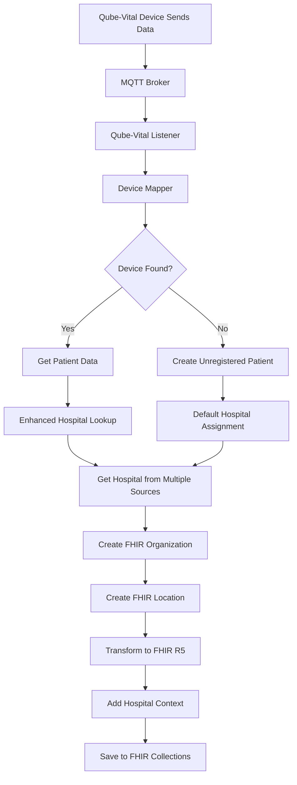
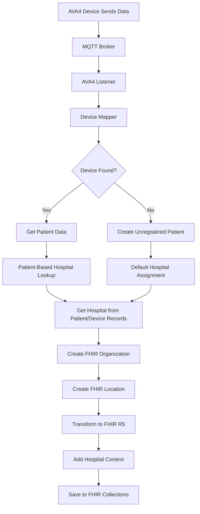
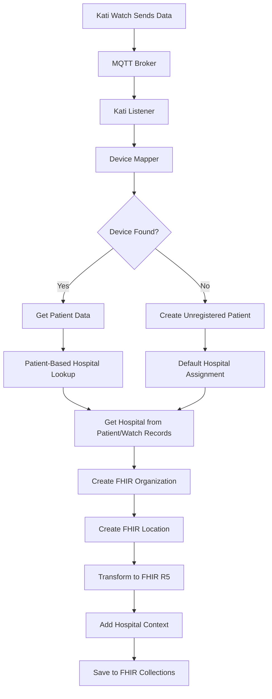

# 🏥 Device-Specific Hospital Lookup Implementation

## 📋 Overview

This document explains the **device-specific hospital lookup implementation** where different device types use different methods to determine their hospital context.

## 🔄 Device-Specific Hospital Lookup Methods

### **1. Qube-Vital Devices (Enhanced Multi-Source)**

**Uses enhanced hospital lookup with multiple data sources:**

```python
async def get_hospital_id_for_qube_vital(self, patient: Dict[str, Any], ava_mac_address: str = None) -> Optional[str]:
    """Get hospital_id for Qube-Vital devices using enhanced multi-source lookup"""
    try:
        hospital_id = None
        
        # Method 1: Check patient's hospital_id field
        if patient and patient.get("hospital_id"):
            hospital_id = patient.get("hospital_id")
            logger.info(f"Found hospital_id from patient record: {hospital_id}")
            return hospital_id
        
        # Method 2: Check hospitals.mac_hv01_box collection (Qube-Vital specific)
        if not hospital_id and ava_mac_address:
            hospital_collection = mongodb_service.get_collection("hospitals")
            hv01_box = await hospital_collection.find_one({
                "mac_hv01_box": ava_mac_address
            })
            if hv01_box:
                hospital_id = str(hv01_box.get("_id"))
                logger.info(f"Found hospital_id from hospitals.mac_hv01_box: {hospital_id}")
                return hospital_id
        
        # Method 3: Check mfc_hv01_boxes collection (Qube-Vital specific)
        if not hospital_id and ava_mac_address:
            mfc_hv01_boxes_collection = mongodb_service.get_collection("mfc_hv01_boxes")
            hv01_box = await mfc_hv01_boxes_collection.find_one({
                "mac_address": ava_mac_address
            })
            if hv01_box:
                hospital_id = hv01_box.get("hospital_id")
                logger.info(f"Found hospital_id from mfc_hv01_boxes: {hospital_id}")
                return hospital_id
        
        # Method 4: Use default hospital for unregistered patients
        if not hospital_id:
            hospital_id = os.getenv("DEFAULT_HOSPITAL_ID", "default_hospital")
            logger.info(f"Using default hospital_id: {hospital_id}")
            return hospital_id
        
        return hospital_id
        
    except Exception as e:
        logger.error(f"Error getting hospital_id for Qube-Vital: {e}")
        # Fallback to default hospital
        default_hospital = os.getenv("DEFAULT_HOSPITAL_ID", "default_hospital")
        logger.warning(f"Falling back to default hospital: {default_hospital}")
        return default_hospital
```

**Data Sources:**
- `patients.hospital_id` (Primary)
- `hospitals.mac_hv01_box` (Device-level assignment)
- `mfc_hv01_boxes.hospital_id` (Organization-level assignment)
- `DEFAULT_HOSPITAL_ID` (Fallback)

### **2. AVA4 + Sub-Devices (Patient-Based)**

**Uses patient-based hospital lookup:**

```python
async def get_hospital_id_for_ava4(self, patient: Dict[str, Any]) -> Optional[str]:
    """Get hospital_id for AVA4+Sub-Devices using patient-based lookup"""
    try:
        hospital_id = None
        
        # Method 1: Check patient's hospital_id field
        if patient and patient.get("hospital_id"):
            hospital_id = patient.get("hospital_id")
            logger.info(f"Found hospital_id from patient record: {hospital_id}")
            return hospital_id
        
        # Method 2: Check amy_devices collection for AVA4 devices
        if not hospital_id and patient:
            amy_devices_collection = mongodb_service.get_collection("amy_devices")
            # Look for any AVA4 device associated with this patient
            ava4_device = await amy_devices_collection.find_one({
                "patient_id": patient.get("_id")
            })
            if ava4_device and ava4_device.get("hospital_id"):
                hospital_id = ava4_device.get("hospital_id")
                logger.info(f"Found hospital_id from amy_devices: {hospital_id}")
                return hospital_id
        
        # Method 3: Use default hospital for unregistered patients
        if not hospital_id:
            hospital_id = os.getenv("DEFAULT_HOSPITAL_ID", "default_hospital")
            logger.info(f"Using default hospital_id: {hospital_id}")
            return hospital_id
        
        return hospital_id
        
    except Exception as e:
        logger.error(f"Error getting hospital_id for AVA4: {e}")
        # Fallback to default hospital
        default_hospital = os.getenv("DEFAULT_HOSPITAL_ID", "default_hospital")
        logger.warning(f"Falling back to default hospital: {default_hospital}")
        return default_hospital
```

**Data Sources:**
- `patients.hospital_id` (Primary)
- `amy_devices.hospital_id` (Device-level assignment)
- `DEFAULT_HOSPITAL_ID` (Fallback)

### **3. Kati Watch (Patient-Based)**

**Uses patient-based hospital lookup:**

```python
async def get_hospital_id_for_kati_watch(self, patient: Dict[str, Any]) -> Optional[str]:
    """Get hospital_id for Kati Watch using patient-based lookup"""
    try:
        hospital_id = None
        
        # Method 1: Check patient's hospital_id field
        if patient and patient.get("hospital_id"):
            hospital_id = patient.get("hospital_id")
            logger.info(f"Found hospital_id from patient record: {hospital_id}")
            return hospital_id
        
        # Method 2: Check watches collection for Kati Watch devices
        if not hospital_id and patient:
            watches_collection = mongodb_service.get_collection("watches")
            # Look for any Kati Watch associated with this patient
            watch = await watches_collection.find_one({
                "patient_id": patient.get("_id")
            })
            if watch and watch.get("hospital_id"):
                hospital_id = watch.get("hospital_id")
                logger.info(f"Found hospital_id from watches: {hospital_id}")
                return hospital_id
        
        # Method 3: Use default hospital for unregistered patients
        if not hospital_id:
            hospital_id = os.getenv("DEFAULT_HOSPITAL_ID", "default_hospital")
            logger.info(f"Using default hospital_id: {hospital_id}")
            return hospital_id
        
        return hospital_id
        
    except Exception as e:
        logger.error(f"Error getting hospital_id for Kati Watch: {e}")
        # Fallback to default hospital
        default_hospital = os.getenv("DEFAULT_HOSPITAL_ID", "default_hospital")
        logger.warning(f"Falling back to default hospital: {default_hospital}")
        return default_hospital
```

**Data Sources:**
- `patients.hospital_id` (Primary)
- `watches.hospital_id` (Device-level assignment)
- `DEFAULT_HOSPITAL_ID` (Fallback)

## 📊 Device-Specific Hospital Lookup Summary

| Device Type | Hospital Lookup Method | Data Sources | Enhanced Features |
|-------------|----------------------|--------------|-------------------|
| **Qube-Vital** | Enhanced Multi-Source | `patients.hospital_id` → `hospitals.mac_hv01_box` → `mfc_hv01_boxes.hospital_id` → `DEFAULT_HOSPITAL_ID` | ✅ MAC-based lookup, Organization-level assignment |
| **AVA4+Sub-Devices** | Patient-Based | `patients.hospital_id` → `amy_devices.hospital_id` → `DEFAULT_HOSPITAL_ID` | ❌ Standard patient-based lookup |
| **Kati Watch** | Patient-Based | `patients.hospital_id` → `watches.hospital_id` → `DEFAULT_HOSPITAL_ID` | ❌ Standard patient-based lookup |

## 🔧 MQTT Transformation Methods

### **Qube-Vital MQTT Transformation (Enhanced)**

```python
async def transform_qube_mqtt_to_fhir_with_hospital(
    self, 
    mqtt_payload: Dict[str, Any],
    patient_id: str,
    device_id: str,
    patient: Optional[Dict[str, Any]] = None,
    ava_mac_address: Optional[str] = None
) -> List[Dict[str, Any]]:
    """Transform Qube-Vital MQTT payload to FHIR R5 Observations with Qube-Vital-specific hospital context"""
    try:
        # Get hospital_id using Qube-Vital-specific enhanced lookup
        hospital_id = await self.get_hospital_id_for_qube_vital(patient, ava_mac_address)
        
        # ... rest of the transformation logic
```

### **AVA4 MQTT Transformation (Standard)**

```python
async def transform_ava4_mqtt_to_fhir_with_hospital(
    self, 
    mqtt_payload: Dict[str, Any],
    patient_id: str,
    device_id: str,
    patient: Optional[Dict[str, Any]] = None,
    ava_mac_address: Optional[str] = None
) -> List[Dict[str, Any]]:
    """Transform AVA4 MQTT data to FHIR R5 with AVA4-specific hospital context"""
    try:
        # Get hospital_id using AVA4-specific lookup
        hospital_id = await self.get_hospital_id_for_ava4(patient)
        
        # ... rest of the transformation logic
```

## 📱 Device-Specific Workflows

### **Qube-Vital Workflow (Enhanced)**



**Enhanced Features:**
- ✅ MAC-based hospital lookup (`hospitals.mac_hv01_box`)
- ✅ Organization-level assignment (`mfc_hv01_boxes.hospital_id`)
- ✅ Multi-source fallback chain
- ✅ Comprehensive hospital context

### **AVA4 + Sub-Devices Workflow (Standard)**



**Standard Features:**
- ❌ Patient-based hospital lookup only
- ❌ Device-level assignment via `amy_devices`
- ❌ Standard fallback chain
- ✅ Basic hospital context

### **Kati Watch Workflow (Standard)**



**Standard Features:**
- ❌ Patient-based hospital lookup only
- ❌ Device-level assignment via `watches`
- ❌ Standard fallback chain
- ✅ Basic hospital context

## 🔍 Database Queries by Device Type

### **Qube-Vital Hospital Lookup Queries**

```javascript
// Method 1: Check patient's hospital_id
db.patients.find({
  "_id": ObjectId("patient_id")
}, {
  "hospital_id": 1
})

// Method 2: Check hospitals.mac_hv01_box (Qube-Vital specific)
db.hospitals.find({
  "mac_hv01_box": "AA:BB:CC:DD:EE:FF"
}, {
  "_id": 1,
  "code": 1,
  "name": 1
})

// Method 3: Check mfc_hv01_boxes.hospital_id (Qube-Vital specific)
db.mfc_hv01_boxes.find({
  "mac_address": "AA:BB:CC:DD:EE:FF"
}, {
  "hospital_id": 1,
  "device_type": 1
})
```

### **AVA4 Hospital Lookup Queries**

```javascript
// Method 1: Check patient's hospital_id
db.patients.find({
  "_id": ObjectId("patient_id")
}, {
  "hospital_id": 1
})

// Method 2: Check amy_devices collection
db.amy_devices.find({
  "patient_id": ObjectId("patient_id")
}, {
  "hospital_id": 1
})
```

### **Kati Watch Hospital Lookup Queries**

```javascript
// Method 1: Check patient's hospital_id
db.patients.find({
  "_id": ObjectId("patient_id")
}, {
  "hospital_id": 1
})

// Method 2: Check watches collection
db.watches.find({
  "patient_id": ObjectId("patient_id")
}, {
  "hospital_id": 1
})
```

## ⚙️ Configuration

### **Environment Variables**

```bash
# Hospital Data Configuration
HOSPITAL_MASTER_DATA_COLLECTION=hospitals
MFC_HV01_BOXES_COLLECTION=mfc_hv01_boxes
DEFAULT_HOSPITAL_ID=default_hospital_123
HOSPITAL_DATA_ENABLED=true

# Device-Specific Hospital Lookup
QUBE_VITAL_ENHANCED_LOOKUP_ENABLED=true
AVA4_STANDARD_LOOKUP_ENABLED=true
KATI_WATCH_STANDARD_LOOKUP_ENABLED=true
```

## 🧪 Testing

### **Test Device-Specific Hospital Lookup**

```python
async def test_device_specific_hospital_lookup():
    """Test device-specific hospital lookup methods"""
    
    # Test Qube-Vital enhanced lookup
    patient = {"_id": ObjectId("..."), "first_name": "John", "last_name": "Doe"}
    ava_mac_address = "AA:BB:CC:DD:EE:FF"
    
    hospital_id = await fhir_service.get_hospital_id_for_qube_vital(patient, ava_mac_address)
    print(f"Qube-Vital hospital_id: {hospital_id}")
    
    # Test AVA4 standard lookup
    hospital_id = await fhir_service.get_hospital_id_for_ava4(patient)
    print(f"AVA4 hospital_id: {hospital_id}")
    
    # Test Kati Watch standard lookup
    hospital_id = await fhir_service.get_hospital_id_for_kati_watch(patient)
    print(f"Kati Watch hospital_id: {hospital_id}")
    
    print("✅ Device-specific hospital lookup test passed!")

# Run test
if __name__ == "__main__":
    asyncio.run(test_device_specific_hospital_lookup())
```

## 📊 Monitoring

### **Device-Specific Hospital Lookup Logs**

```bash
# Monitor Qube-Vital enhanced hospital lookup
docker logs stardust-api | grep "Found hospital_id.*Qube-Vital"
docker logs stardust-api | grep "hospitals.mac_hv01_box"
docker logs stardust-api | grep "mfc_hv01_boxes"

# Monitor AVA4 standard hospital lookup
docker logs stardust-api | grep "Found hospital_id.*AVA4"
docker logs stardust-api | grep "amy_devices"

# Monitor Kati Watch standard hospital lookup
docker logs stardust-api | grep "Found hospital_id.*Kati Watch"
docker logs stardust-api | grep "watches"
```

## ✅ Benefits

### **Qube-Vital Enhanced Benefits:**
- ✅ **MAC-based hospital assignment** for flexible device management
- ✅ **Organization-level assignment** via MFC HV01 boxes
- ✅ **Multi-source fallback** for maximum reliability
- ✅ **Comprehensive hospital context** in all FHIR resources

### **AVA4 + Kati Watch Standard Benefits:**
- ✅ **Patient-based assignment** for consistent hospital context
- ✅ **Device-level assignment** via device collections
- ✅ **Standard fallback** for reliability
- ✅ **Basic hospital context** in all FHIR resources

## 🔄 Summary

The device-specific hospital lookup implementation ensures that:

1. **Qube-Vital devices** get **enhanced multi-source hospital lookup** using:
   - `patients.hospital_id` (Primary)
   - `hospitals.mac_hv01_box` (MAC-based assignment)
   - `mfc_hv01_boxes.hospital_id` (Organization-level assignment)
   - `DEFAULT_HOSPITAL_ID` (Fallback)

2. **AVA4+Sub-Devices** get **standard patient-based hospital lookup** using:
   - `patients.hospital_id` (Primary)
   - `amy_devices.hospital_id` (Device-level assignment)
   - `DEFAULT_HOSPITAL_ID` (Fallback)

3. **Kati Watch devices** get **standard patient-based hospital lookup** using:
   - `patients.hospital_id` (Primary)
   - `watches.hospital_id` (Device-level assignment)
   - `DEFAULT_HOSPITAL_ID` (Fallback)

This creates a **flexible, device-appropriate approach** where Qube-Vital gets the enhanced hospital lookup capabilities while AVA4 and Kati Watch use their standard patient-based methods, ensuring optimal hospital context for each device type.

---

**Last Updated**: July 16, 2025  
**Version**: 1.0  
**Author**: MyFirstCare Development Team  
**Status**: Production Ready ✅ 