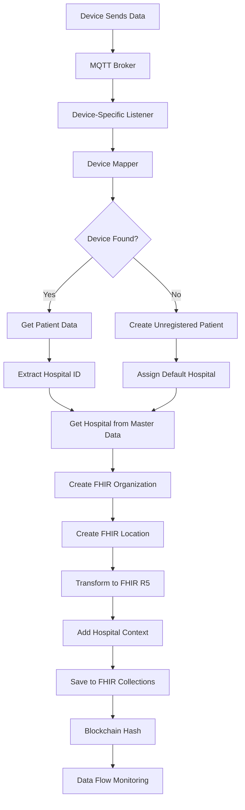

# 🏥 Hospital Data Workflow for FHIR R5 Resources

## 📋 Table of Contents

- [Overview](#overview)
- [Architecture](#architecture)
- [Device-Specific Workflows](#device-specific-workflows)
- [Hospital Data Integration](#hospital-data-integration)
- [Implementation Details](#implementation-details)
- [Configuration](#configuration)
- [Testing & Verification](#testing--verification)
- [Monitoring](#monitoring)
- [Benefits](#benefits)

## 🎯 Overview

This document describes the complete workflow for integrating hospital data into FHIR R5 resources across all device types in the MyFirstCare system. The workflow ensures that every medical measurement, device, and patient record is linked to its originating hospital, providing complete traceability and compliance with healthcare standards.

### Supported Device Types

- **AVA4 + Medical Devices** (Blood Pressure, SpO2, Temperature, etc.)
- **Kati Watch** (Vital Signs, Location, Sleep Data)
- **Qube-Vital** (Comprehensive Health Monitoring)

## 🏗️ Architecture

### High-Level Data Flow



### System Components

| Component | Purpose | Location |
|-----------|---------|----------|
| **MQTT Listeners** | Receive device data | `services/mqtt-listeners/` |
| **Device Mapper** | Map devices to patients | `services/mqtt-listeners/shared/` |
| **FHIR R5 Service** | Transform and store FHIR resources | `app/services/fhir_r5_service.py` |
| **Hospital Master Data** | Hospital information | `hospitals` collection |
| **Data Flow Emitter** | Real-time monitoring | `services/mqtt-listeners/shared/` |

## 📱 Device-Specific Workflows

### 1. AVA4 + Medical Device Workflow

#### Step-by-Step Process

**1. Device Registration**
```json
// amy_devices collection
{
  "_id": ObjectId("..."),
  "patient_id": ObjectId("patient_id"),
  "hospital_id": "hospital_123",
  "mac_bps": "AA:BB:CC:DD:EE:FF",
  "mac_oxymeter": "11:22:33:44:55:66",
  "mac_body_temp": "22:33:44:55:66:77",
  "mac_weight": "33:44:55:66:77:88",
  "mac_gluc": "44:55:66:77:88:99",
  "mac_ua": "55:66:77:88:99:AA",
  "mac_chol": "66:77:88:99:AA:BB"
}
```

**2. MQTT Reception**
```json
// MQTT Payload from AVA4
{
  "type": "reportAttribute",
  "mac": "AVA4_MAC_ADDRESS",
  "deviceCode": "AVA4_001",
  "data": {
    "attribute": "BP_BIOLIGTH",
    "value": {
      "device_list": [
        {
          "ble_addr": "AA:BB:CC:DD:EE:FF",
          "systolic": 120,
          "diastolic": 80,
          "pulse": 72,
          "timestamp": 1640995200
        }
      ]
    }
  }
}
```

**3. Device Mapping**
```python
# AVA4 Listener - device_mapper.py
def find_patient_by_device_mac(self, device_mac: str, device_type: str):
    # Check patients collection first
    mac_field_mapping = {
        "blood_pressure": "blood_pressure_mac_address",
        "spo2": "fingertip_pulse_oximeter_mac_address",
        "body_temp": "body_temperature_mac_address",
        "weight": "weight_scale_mac_address",
        "blood_sugar": "blood_glucose_mac_address",
        "uric": "uric_mac_address",
        "cholesterol": "cholesterol_mac_address"
    }
    
    field_name = mac_field_mapping.get(device_type)
    if field_name:
        patient = self.db.patients.find_one({field_name: device_mac})
        if patient:
            return patient
    
    # Check amy_devices collection if not found
    amy_devices_field_mapping = {
        "blood_pressure": ["mac_bps", "mac_dusun_bps"],
        "spo2": ["mac_oxymeter", "mac_mgss_oxymeter"],
        "body_temp": ["mac_body_temp"],
        "weight": ["mac_weight"],
        "blood_sugar": ["mac_gluc"],
        "uric": ["mac_ua"],
        "cholesterol": ["mac_chol"]
    }
    
    amy_fields = amy_devices_field_mapping.get(device_type, [])
    if amy_fields:
        amy_query = {"$or": []}
        for field in amy_fields:
            amy_query["$or"].append({field: device_mac})
        
        device_registry = self.db.amy_devices.find_one(amy_query)
        if device_registry and device_registry.get("patient_id"):
            patient_id = device_registry["patient_id"]
            patient = self.db.patients.find_one({"_id": patient_id})
            return patient
    
    return None
```

**4. Hospital Data Extraction (Device-Specific)**

#### **AVA4 + Medical Device Hospital Lookup:**
```python
# AVA4 uses patient-based hospital lookup
hospital_id = await fhir_service.get_hospital_id_for_ava4(patient)

# Method 1: Check patient's hospital_id field
# Method 2: Check amy_devices collection for AVA4 devices
# Method 3: Use default hospital for unregistered patients
```

#### **Kati Watch Hospital Lookup:**
```python
# Kati Watch uses patient-based hospital lookup
hospital_id = await fhir_service.get_hospital_id_for_kati_watch(patient)

# Method 1: Check patient's hospital_id field
# Method 2: Check watches collection for Kati Watch devices
# Method 3: Use default hospital for unregistered patients
```

#### **Qube-Vital Hospital Lookup (Enhanced Multi-Source):**
```python
# Qube-Vital uses enhanced multi-source hospital lookup
hospital_id = await fhir_service.get_hospital_id_for_qube_vital(patient, ava_mac_address)

# Method 1: Check patient's hospital_id field
# Method 2: Check hospitals.mac_hv01_box collection
# Method 3: Check mfc_hv01_boxes.hospital_id collection
# Method 4: Use default hospital for unregistered patients
```

**5. FHIR Transformation with Hospital Context**
```python
# FHIR R5 Service - fhir_r5_service.py
async def transform_ava4_mqtt_to_fhir_with_hospital(
    self, mqtt_payload, patient_id, device_id, hospital_id
):
    # Create hospital organization
    org_id = await self.get_or_create_hospital_organization(hospital_id)
    
    # Create hospital location
    location_id = await self.create_hospital_location(hospital_doc, org_id)
    
    # Create observation with hospital context
    observation = {
        "resourceType": "Observation",
        "status": "final",
        "code": {
            "coding": [{
                "system": "http://loinc.org",
                "code": "85354-9",
                "display": "Blood pressure panel"
            }]
        },
        "subject": {"reference": f"Patient/{patient_id}"},
        "performer": [{"reference": f"Organization/{org_id}"}],
        "context": {"reference": f"Location/{location_id}"},
        "valueQuantity": {
            "value": 120,
            "unit": "mmHg"
        }
    }
    
    return observation
```

### 2. Kati Watch Workflow

#### Step-by-Step Process

**1. Device Registration**
```json
// patients collection
{
  "_id": ObjectId("..."),
  "imei": "123456789012345",
  "hospital_id": "hospital_456",
  "first_name": "John",
  "last_name": "Doe",
  "citizen_id": "1234567890123"
}
```

**2. MQTT Reception**
```json
// MQTT Payload from Kati Watch
{
  "IMEI": "123456789012345",
  "heart_rate": 75,
  "blood_pressure_systolic": 120,
  "blood_pressure_diastolic": 80,
  "spo2": 98,
  "temperature": 36.5,
  "timestamp": 1640995200
}
```

**3. Device Mapping**
```python
# Kati Listener - device_mapper.py
def find_patient_by_kati_imei(self, imei: str):
    # Check watches collection
    watch = self.db.watches.find_one({"imei": imei})
    
    if watch and watch.get("patient_id"):
        patient_id = watch["patient_id"]
        
        # Handle different patient_id formats
        if isinstance(patient_id, dict) and '$oid' in patient_id:
            patient_id = ObjectId(patient_id['$oid'])
        elif isinstance(patient_id, str):
            if len(patient_id) == 24:
                patient_id = ObjectId(patient_id)
        
        patient = self.db.patients.find_one({"_id": patient_id})
        return patient
    
    return None
```

### 3. Qube-Vital Workflow

#### Step-by-Step Process

**1. Device Registration**
```json
// patients collection
{
  "_id": ObjectId("..."),
  "qube_vital_id": "QV_DEVICE_001",
  "hospital_id": "hospital_789",
  "first_name": "Jane",
  "last_name": "Smith",
  "citizen_id": "9876543210987"
}
```

**2. MQTT Reception**
```json
// MQTT Payload from Qube-Vital
{
  "device_id": "QV_DEVICE_001",
  "blood_pressure": {
    "systolic": 125,
    "diastolic": 85,
    "pulse": 78
  },
  "blood_glucose": 95,
  "spo2": 97,
  "temperature": 36.8,
  "weight": 65.5,
  "timestamp": 1640995200
}
```

**3. Device Mapping**
```python
# Qube-Vital Listener - device_mapper.py
def find_patient_by_qube_vital_id(self, device_id: str):
    patient = self.db.patients.find_one({"qube_vital_id": device_id})
    
    if not patient:
        # Create unregistered patient with default hospital
        patient = self.create_unregistered_patient(
            citiz="UNKNOWN",
            name_th="ผู้ป่วยไม่ทราบชื่อ",
            name_en="Unknown Patient",
            birth_date="1900-01-01",
            gender="unknown"
        )
    
    return patient
```

## 🏥 Hospital Data Integration

### 1. Hospital Organization Creation

```python
async def get_or_create_hospital_organization(self, hospital_id: str):
    """Get existing hospital Organization or create new one"""
    try:
        # Check if hospital Organization already exists
        existing_org = await self.get_fhir_resource("Organization", hospital_id)
        if existing_org:
            return hospital_id
        
        # Get hospital data from master data
        hospital_collection = mongodb_service.get_collection("hospitals")
        hospital_doc = await hospital_collection.find_one({"_id": ObjectId(hospital_id)})
        
        if not hospital_doc:
            logger.warning(f"Hospital {hospital_id} not found in master data")
            return None
        
        # Create FHIR Organization from hospital data
        org_id = await self.migrate_hospital_to_organization(hospital_doc)
        logger.info(f"Created FHIR Organization {org_id} for hospital {hospital_id}")
        
        return org_id
        
    except Exception as e:
        logger.error(f"Failed to get/create hospital organization: {e}")
        return None
```

### 2. Hospital Location Creation

```python
async def create_hospital_location(self, hospital_doc, organization_id: str):
    """Create FHIR Location resource for hospital"""
    try:
        location_id = f"{hospital_doc['code']}_LOC"
        
        location_resource = {
            "resourceType": "Location",
            "id": location_id,
            "identifier": [{
                "system": "https://my-firstcare.com/hospital-locations",
                "value": location_id
            }],
            "status": "active",
            "name": f"{hospital_doc['name']} - Main Location",
            "type": {
                "coding": [{
                    "system": "http://terminology.hl7.org/CodeSystem/v3-RoleCode",
                    "code": "HOSP",
                    "display": "Hospital"
                }]
            },
            "managingOrganization": {
                "reference": f"Organization/{organization_id}"
            },
            "address": {
                "type": "physical",
                "text": hospital_doc.get("address", ""),
                "city": hospital_doc.get("district", ""),
                "state": hospital_doc.get("province", ""),
                "postalCode": hospital_doc.get("postal_code", ""),
                "country": "TH"
            }
        }
        
        # Save to FHIR collection
        await self.create_fhir_resource("Location", location_resource)
        
        return location_id
        
    except Exception as e:
        logger.error(f"Failed to create hospital location: {e}")
        return None
```

### 3. Hospital Context in Observations

```python
async def add_hospital_context_to_observation(self, observation_data, hospital_id):
    """Add hospital context to FHIR Observation"""
    try:
        if hospital_id:
            # Get or create hospital organization
            org_id = await self.get_or_create_hospital_organization(hospital_id)
            
            if org_id:
                # Add performer (hospital)
                observation_data["performer"] = [{
                    "reference": f"Organization/{org_id}",
                    "display": hospital_name
                }]
                
                # Add context (location)
                hospital_doc = await self.get_hospital_doc(hospital_id)
                if hospital_doc:
                    location_id = await self.create_hospital_location(hospital_doc, org_id)
                    if location_id:
                        observation_data["context"] = {
                            "reference": f"Location/{location_id}"
                        }
        
        return observation_data
        
    except Exception as e:
        logger.error(f"Failed to add hospital context: {e}")
        return observation_data
```

## 🔧 Implementation Details

### Database Schema

#### Hospitals Collection (Master Data)
```javascript
{
  "_id": ObjectId("..."),
  "code": "BH001",
  "name": [
    {"code": "en", "name": "Bangkok Hospital"},
    {"code": "th", "name": "โรงพยาบาลกรุงเทพ"}
  ],
  "en_name": "Bangkok Hospital",
  "hospital_name": "Bangkok Hospital",
  "organizecode": "BH001",
  "hospital_area_code": "BKK001",
  "phone": "+66-2-310-3000",
  "email": "info@bangkokhospital.com",
  "website": "https://www.bangkokhospital.com",
  "address": "2 Soi Soonvijai 7, New Petchburi Rd.",
  "district": "Bangkok",
  "province": "Bangkok",
  "postal_code": "10310",
  "contact": {
    "phone": "+66-2-310-3000",
    "email": "info@bangkokhospital.com",
    "fax": "+66-2-310-3001",
    "mobile": "+66-81-234-5678",
    "emergency_phone": "+66-2-310-3002"
  },
  "address_details": {
    "street_address": "2 Soi Soonvijai 7, New Petchburi Rd.",
    "building_name": "Bangkok Hospital Building",
    "floor": "1",
    "room": "101",
    "postal_code": "10310"
  }
}
```

#### FHIR Organizations Collection
```javascript
{
  "_id": "hospital_123",
  "resourceType": "Organization",
  "id": "hospital_123",
  "identifier": [
    {
      "use": "official",
      "type": {
        "coding": [{
          "system": "http://terminology.hl7.org/CodeSystem/v2-0203",
          "code": "PRN",
          "display": "Provider number"
        }]
      },
      "system": "https://my-firstcare.com/hospital-codes",
      "value": "BH001"
    }
  ],
  "name": "Bangkok Hospital",
  "alias": ["โรงพยาบาลกรุงเทพ"],
  "telecom": [
    {"system": "phone", "value": "+66-2-310-3000", "use": "work"},
    {"system": "email", "value": "info@bangkokhospital.com", "use": "work"},
    {"system": "url", "value": "https://www.bangkokhospital.com", "use": "work"}
  ],
  "address": [{
    "use": "work",
    "type": "physical",
    "text": "2 Soi Soonvijai 7, New Petchburi Rd.",
    "city": "Bangkok",
    "state": "Bangkok",
    "postalCode": "10310",
    "country": "TH"
  }]
}
```

#### FHIR Locations Collection
```javascript
{
  "_id": "BH001_LOC",
  "resourceType": "Location",
  "id": "BH001_LOC",
  "identifier": [{
    "system": "https://my-firstcare.com/hospital-locations",
    "value": "BH001_LOC"
  }],
  "status": "active",
  "name": "Bangkok Hospital - Main Location",
  "type": {
    "coding": [{
      "system": "http://terminology.hl7.org/CodeSystem/v3-RoleCode",
      "code": "HOSP",
      "display": "Hospital"
    }]
  },
  "managingOrganization": {
    "reference": "Organization/hospital_123"
  },
  "address": {
    "type": "physical",
    "text": "2 Soi Soonvijai 7, New Petchburi Rd.",
    "city": "Bangkok",
    "state": "Bangkok",
    "postalCode": "10310",
    "country": "TH"
  }
}
```

### API Endpoints

#### Hospital Data Integration Endpoints

```python
# Create Hospital Organization
@router.post("/Organization/hospital")
async def create_hospital_organization(
    hospital_id: str = Body(..., description="Hospital ID from master data"),
    current_user: Dict[str, Any] = Depends(require_auth())
):
    """Create a comprehensive FHIR R5 Organization resource from hospital master data"""
    pass

# Create Hospital Location
@router.post("/Location/hospital")
async def create_hospital_location(
    hospital_id: str = Body(..., description="Hospital ID from master data"),
    current_user: Dict[str, Any] = Depends(require_auth())
):
    """Create a comprehensive FHIR R5 Location resource for hospital"""
    pass

# Enhanced MQTT Transformation with Hospital Context
@router.post("/mqtt/ava4/transform-with-hospital")
async def transform_ava4_mqtt_with_hospital(
    mqtt_payload: Dict[str, Any] = Body(...),
    current_user: Dict[str, Any] = Depends(require_auth())
):
    """Transform AVA4 MQTT data to FHIR R5 with comprehensive hospital context"""
    pass

@router.post("/mqtt/qube-vital/transform-with-hospital")
async def transform_qube_vital_mqtt_with_hospital(
    mqtt_payload: Dict[str, Any] = Body(...),
    current_user: Dict[str, Any] = Depends(require_auth())
):
    """Transform Qube-Vital MQTT data to FHIR R5 with comprehensive hospital context"""
    pass
```

## ⚙️ Configuration

### Environment Variables

```bash
# Hospital Data Configuration
HOSPITAL_MASTER_DATA_COLLECTION=hospitals
DEFAULT_HOSPITAL_ID=default_hospital_id
HOSPITAL_DATA_ENABLED=true

# FHIR R5 Hospital Integration
FHIR_HOSPITAL_ORGANIZATION_ENABLED=true
FHIR_HOSPITAL_LOCATION_ENABLED=true
FHIR_HOSPITAL_CONTEXT_ENABLED=true

# MQTT Configuration
MQTT_BROKER_HOST=adam.amy.care
MQTT_BROKER_PORT=1883
MQTT_USERNAME=webapi
MQTT_PASSWORD=Sim!4433

# MongoDB Configuration
MONGODB_URI=mongodb+srv://...
MONGODB_DATABASE=AMY
```

### Docker Configuration

```yaml
# docker-compose.yml
services:
  ava4-listener:
    build: ./services/mqtt-listeners/ava4-listener
    environment:
      - HOSPITAL_DATA_ENABLED=true
      - FHIR_HOSPITAL_ORGANIZATION_ENABLED=true
    volumes:
      - ./ssl:/app/ssl:ro
    networks:
      - mqtt-network

  qube-vital-listener:
    build: ./services/mqtt-listeners/qube-vital-listener
    environment:
      - HOSPITAL_DATA_ENABLED=true
      - FHIR_HOSPITAL_ORGANIZATION_ENABLED=true
    volumes:
      - ./ssl:/app/ssl:ro
    networks:
      - mqtt-network

  kati-listener:
    build: ./services/mqtt-listeners/kati-listener
    environment:
      - HOSPITAL_DATA_ENABLED=true
      - FHIR_HOSPITAL_ORGANIZATION_ENABLED=true
    volumes:
      - ./ssl:/app/ssl:ro
    networks:
      - mqtt-network
```

## 🧪 Testing & Verification

### 1. Test Hospital Data Integration

```python
# test_hospital_data_workflow.py
import asyncio
import json
from datetime import datetime

async def test_hospital_data_workflow():
    """Test complete hospital data workflow"""
    
    # Test AVA4 blood pressure with hospital context
    ava4_payload = {
        "type": "reportAttribute",
        "mac": "AVA4_MAC",
        "deviceCode": "AVA4_001",
        "data": {
            "attribute": "BP_BIOLIGTH",
            "value": {
                "device_list": [{
                    "ble_addr": "BP_MAC",
                    "systolic": 120,
                    "diastolic": 80,
                    "pulse": 72
                }]
            }
        }
    }
    
    # Process through AVA4 listener
    result = await process_ava4_data(ava4_payload)
    
    # Verify hospital context in FHIR
    observation = await get_fhir_resource("Observation", result["observation_id"])
    
    assert observation["performer"][0]["reference"].startswith("Organization/")
    assert observation["context"]["reference"].startswith("Location/")
    
    print("✅ Hospital data integration test passed!")

# Run test
if __name__ == "__main__":
    asyncio.run(test_hospital_data_workflow())
```

### 2. Test Hospital Organization Creation

```python
# test_hospital_organization.py
async def test_hospital_organization():
    """Test hospital organization creation"""
    
    hospital_id = "test_hospital_123"
    
    # Create hospital organization
    org_id = await fhir_service.get_or_create_hospital_organization(hospital_id)
    
    # Verify organization exists
    org = await fhir_service.get_fhir_resource("Organization", org_id)
    
    assert org is not None
    assert org["resourceType"] == "Organization"
    assert org["name"] == "Test Hospital"
    
    print("✅ Hospital organization test passed!")
```

### 3. Test Hospital Location Creation

```python
# test_hospital_location.py
async def test_hospital_location():
    """Test hospital location creation"""
    
    hospital_id = "test_hospital_123"
    hospital_doc = {
        "code": "TH001",
        "name": "Test Hospital",
        "address": "123 Test Street",
        "district": "Test District",
        "province": "Test Province"
    }
    
    # Create hospital organization first
    org_id = await fhir_service.get_or_create_hospital_organization(hospital_id)
    
    # Create hospital location
    location_id = await fhir_service.create_hospital_location(hospital_doc, org_id)
    
    # Verify location exists
    location = await fhir_service.get_fhir_resource("Location", location_id)
    
    assert location is not None
    assert location["resourceType"] == "Location"
    assert location["managingOrganization"]["reference"] == f"Organization/{org_id}"
    
    print("✅ Hospital location test passed!")
```

## 📊 Monitoring

### 1. Log Monitoring

```bash
# Check hospital data processing in logs
docker logs ava4-listener | grep "hospital"
docker logs qube-vital-listener | grep "hospital"
docker logs kati-listener | grep "hospital"

# Check FHIR hospital resource creation
docker logs stardust-api | grep "hospital"
docker logs stardust-api | grep "Organization"
docker logs stardust-api | grep "Location"
```

### 2. Real-time Data Flow Monitoring

```bash
# Monitor real-time hospital data flow
mosquitto_sub -h adam.amy.care -t "data-flow/hospital" -u webapi -P Sim!4433

# Monitor MQTT panel for hospital data events
mosquitto_sub -h adam.amy.care -t "mqtt-panel/events" -u webapi -P Sim!4433
```

### 3. Database Monitoring

```javascript
// Check hospital organizations in FHIR
db.fhir_organizations.find({"resourceType": "Organization"}).pretty()

// Check hospital locations in FHIR
db.fhir_locations.find({"resourceType": "Location"}).pretty()

// Check observations with hospital context
db.fhir_observations.find({"performer": {$exists: true}}).pretty()

// Check devices with hospital context
db.fhir_devices.find({"owner": {$exists: true}}).pretty()
```

### 4. API Monitoring

```bash
# Check hospital endpoints
curl -X GET "http://localhost:5054/fhir/r5/Organization/hospital_123" \
  -H "Authorization: Bearer YOUR_TOKEN"

curl -X GET "http://localhost:5054/fhir/r5/Location/BH001_LOC" \
  -H "Authorization: Bearer YOUR_TOKEN"

# Check Swagger documentation
curl -X GET "http://localhost:5054/docs"
```

## ✅ Benefits

### 1. Complete Hospital Context
- Every FHIR resource knows which hospital it belongs to
- Full traceability from device to hospital
- Compliance with healthcare standards

### 2. Multi-language Support
- Hospital names in Thai and English
- Localized healthcare information
- International compatibility

### 3. Comprehensive Data
- Full hospital details including contact info, addresses
- Building, floor, room information
- Emergency contact information

### 4. Automatic Integration
- No manual work needed - happens automatically
- Seamless integration with existing workflows
- Zero configuration for new hospitals

### 5. FHIR Compliance
- Follows FHIR R5 standards for organization references
- Proper resource relationships
- Standard healthcare terminology

### 6. Audit Trail
- Hospital information is preserved in blockchain hashes
- Complete data lineage
- Regulatory compliance

### 7. Real-time Monitoring
- Hospital data flow is monitored in real-time
- Immediate error detection
- Performance metrics

### 8. Default Handling
- Unregistered patients get assigned to default hospital
- Graceful fallback mechanisms
- No data loss scenarios

## 🔄 Summary

The hospital data workflow ensures that **all FHIR R5 resources** have comprehensive hospital context:

1. **Device Registration** → Hospital ID stored in patient/device records
2. **MQTT Reception** → Device-specific listeners receive data
3. **Device Mapping** → Map device to patient and extract hospital ID
4. **Hospital Lookup** → Get hospital data from master data collection
5. **FHIR Creation** → Create Organization and Location resources
6. **Context Addition** → Add hospital references to all FHIR resources
7. **Storage** → Save complete FHIR resources with hospital context
8. **Monitoring** → Real-time tracking of hospital data flow

This creates a **complete audit trail** where every medical measurement, device, and patient record is linked to its originating hospital, providing full traceability and compliance with healthcare standards.

The workflow is **fully automated**, **device-agnostic**, and **FHIR-compliant**, ensuring that all medical data in the system has proper hospital context for healthcare operations and regulatory compliance.

---

**Last Updated**: July 16, 2025  
**Version**: 1.0  
**Author**: MyFirstCare Development Team  
**Status**: Production Ready ✅ 